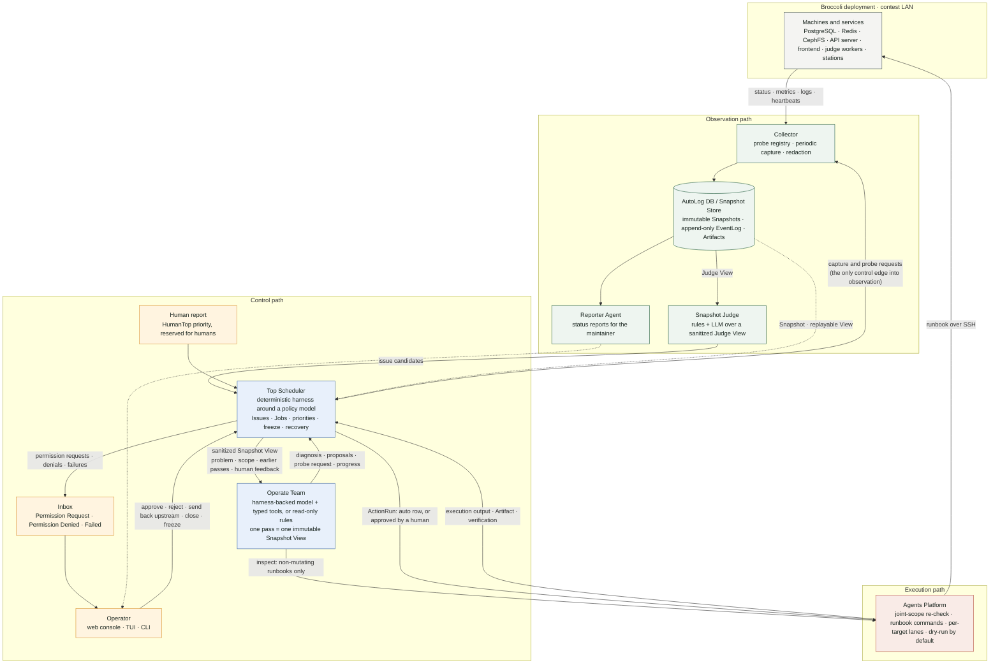

# Broccoli DevOps Agent

English | [简体中文](./README.zh-CN.md)

An agentic operations control plane for the Broccoli online judging system, written in Rust with its own model-agnostic agent harness.

It loads a static deployment topology, probes real endpoints, builds immutable Snapshots, accepts human reports, dispatches an Operate Job over an exact sanitized Snapshot View (through a deterministic Team or a model-backed one), runs the Job's proposed actions through an approved authority matrix into the Agents Platform, verifies their effect, parks every denial and failure in a three-category inbox for a human, sends human feedback back upstream as a revising Job, persists everything to disk, and recovers control state after a restart. An investigation is a bounded chain of such passes: a pass can inspect a target read-only, ask for specific probes and be superseded by a pass over a fresh Snapshot, or ask for a follow-up pass to check the effect of its actions — and a model's "solved" counts only when the Scheduler can confirm it. Machines are touched only through the runbook commands you configure, and only once you leave dry-run.

**The model proposes; the runtime records and enforces.**

- [Quickstart](#quickstart)
- [Architecture at a glance](#architecture-at-a-glance)
- [Configuration](#configuration)
- [Operator UIs](#operator-uis)
- [Workspace layout](#workspace-layout)
- [Running the v0.1 slice](#running-the-v01-slice)
- [Actions and the inbox](#actions-and-the-inbox)
- [Watching a run, and what it costs](#watching-a-run-and-what-it-costs)
- [Testbed](#testbed)
- [Recommended reading order](#recommended-reading-order)
- [Current boundaries](#current-boundaries)
- [Validation](#validation)

See the [architecture document](./docs/architecture.md) for the complete design, the [presentation overview](./docs/presentation/overview.md) for a shorter tour, and the [Excalidraw source](./docs/broccoli-devops-agent-architecture.excalidraw) for the editable diagram.

## Quickstart

Prerequisites: a Rust nightly toolchain (`rust-toolchain.toml` selects it; `rustup` installs it on first build), and Node 20+ with `pnpm` for the web console. Nothing else is needed for the first two steps: no model relay, no deployment.

### 1. Try the consoles in five minutes

Seed a demo data directory that already holds one item of each inbox category, serve it with the deterministic Team, and open the web console:

```bash
cargo run --example seed_demo -- data-demo
```

```bash
cargo run -- serve --data data-demo --topology data-demo/topology.toml --team readonly
```

```bash
cd web && pnpm install && pnpm dev
```

Open <http://localhost:5180>. The inbox holds a permission request (approve it, or reject it with a comment), a rule denial, a failed action, and a failed Job (acknowledge them, or send them back upstream to watch a revising pass run with your comment in front of it). The Overview shows the live Snapshot with its coverage gaps; the Issues & jobs page shows every pass; Trace opens the transcript behind one.

### 2. Watch a pass run live

Serve a scripted, deliberately slow model instead. Every report filed from the console runs the same four-turn investigation, one turn every two seconds, so the Trace page shows the transcript growing entry by entry, the report form shows progress lines, and Interrupt stops the pass cooperatively:

```bash
cargo run --example live_demo -- data-live
```

```bash
cd web && pnpm dev
```

File a report from the console, open its Trace, approve the held queue purge in the inbox, then press **Export** to save the whole session as one JSON file.

### 3. Point it at your deployment, with a real model

```bash
cp config/agent.example.toml config/agent.toml && cp config/topology.example.toml config/topology.toml
```

Edit `config/topology.toml` with your hosts, ports, and probes, and `config/agent.toml` with your model relay. Export the API key (the file only names the variable), then:

```bash
export BROCCOLI_MODEL_API_KEY=...
```

```bash
cargo run -- check-model
```

```bash
cargo run -- snapshot
```

```bash
cargo run -- report --title "Contestants cannot submit" --description "Web submissions time out since 10:12"
```

```bash
cargo run -- inbox
```

```bash
cargo run -- serve
```

The Platform starts in dry-run: proposed commands are rendered and recorded, never executed, until you set `dry_run = false` in `config/agent.toml` (or from the console's Settings page while the Scheduler is frozen). Runbooks execute as the commands you map under `[[platform.runbooks]]`; credentials stay with your SSH agent.

### 4. The terminal console

```bash
cargo run -p broccoli-tui -- --api http://127.0.0.1:4720
```

## Architecture at a glance



The same graph is kept as [`docs/presentation/architecture.mmd`](./docs/presentation/architecture.mmd). Three paths: the **observation path** turns machines into immutable Snapshots; the **control path** turns Snapshots and human reports into Issues, Jobs, and decisions; the **execution path** turns approved decisions into runbook commands and verifies their effect. The Scheduler's capture request is the only arrow pointing back into observation, and the Scheduler is the only component that creates ActionRuns, which is where freeze modes are enforced.

## Configuration

Two files, both safe to commit — neither holds credentials:

- `config/agent.toml` (copy from [`config/agent.example.toml`](./config/agent.example.toml)): the agent's output language (`[agent] language = "en"` or `"zh-CN"` — everything the agent writes, from event summaries and denial reasons to the model's diagnoses, comes out in it; fixed for the life of the process), data directory, topology path, the model relay (`base_url`, `model`, `wire_api`) with the **name** of the environment variable that carries the API key, the per-run budgets (`max_model_turns`, `max_tool_calls`, `max_inspections`, `max_tokens_per_run`), what the relay charges (`[model.pricing]`, per million tokens), the cumulative spend ceiling (`[budget]`), the Collector's cadence (`[collector] snapshot_interval_secs`, default 120: while `serve` runs, one Snapshot at startup and then one every two minutes, in every Scheduler mode; 0 switches it off), and `[agent] max_auto_passes` — how many passes the control plane runs on its own per report or per send-back before a human must continue (default three: observe, act, check). Export the key variable before running a model-backed command.
- `config/topology.toml` (copy from [`config/topology.example.toml`](./config/topology.example.toml)): every machine and endpoint — PostgreSQL, Redis, CephFS/object storage, the API server, frontend, judge workers, and stations — with the read-only probes used to observe them: `tcp.connect` and `http.status` for reachability (with a `degraded_above_ms` latency threshold), `redis.llen` for queue backlog, `http.json` for any unauthenticated JSON counter, and `broccoli.worker` / `broccoli.queue`, which read worker heartbeats and MQ queue depths from Broccoli's admin API (the same data as the admin dashboard), each with `min`/`max`/`expect` health criteria. The admin API needs a login with `system:view`: export `BROCCOLI_PROBE_LOGIN=username:password` before running; the topology file only names the variable.

`broccoli-devops-agent config show` prints the effective configuration as JSON (key redacted) for a frontend or for checking what the agent will actually use.

## Operator UIs

The control plane exposes an HTTP + SSE API (`serve`), and two user interfaces are pure clients of it — one process, two consoles, no UI-only state:

```bash
# Terminal 1: the control plane API (localhost:4720 by default; see [api] in config/agent.toml).
# Startup recovers first: interrupted work is reconciled into the inbox and the previous freeze
# is restored; dispatch resumes on its own only after a clean restart (--stay-frozen to never).
cargo run -- serve

# Terminal 2: the web console — plain React + Vite + Tailwind, styled after Broccoli's own
# web UI (same design tokens, sidebar, cards, badges) but depending on no Broccoli package.
cd web && pnpm install && pnpm dev          # http://localhost:5180, /api proxied to :4720

# Or the terminal console.
cargo run -p broccoli-tui                   # --api http://127.0.0.1:4720 --token ...
```

The web console has the inbox in its three categories — permission requests (approve, or reject with a comment), permission denials (who refused and why; send back upstream or acknowledge), and failures (jobs and actions; the same two decisions) — plus the live Snapshot with coverage gaps, issues and jobs with their feedback and transcript links, a live event stream, freeze/resume controls, the human-report form with live progress while a pass runs, the passes in flight with an Interrupt button for each, and what the model relay has cost so far against its ceiling. Every decision records the operator's name.

The Issues & jobs page is the history: every Issue with every pass, filterable (open, closed, archives) and searchable. Its **Trace** opens the workflow behind an Issue rather than a black box — the pass chain (initial pass, then passes that gathered more data, revised on human feedback, or followed up on an action) and, for the selected pass, the transcript entry by entry: the inputs, each model turn with its latency and token count, every tool call with its arguments and output (errors, refusals, and untrusted data marked as such), the harness's own notices, and alongside it the pass's result, the actions it proposed with their matrix and human decisions, and the Issue's event log. While a pass runs the transcript grows live, entry by entry, the way a coding agent's terminal does; when it ends the stored transcript takes over, identical entry for entry. **Export** saves the whole session — the Issue, its passes with their transcripts and the Snapshot Views the model read, its actions, Snapshots, and events — as one JSON file, and **Import session…** loads such a file as a read-only archive: it shows and traces like any other Issue, and every control decision (dispatch, approval, review, closure, recovery, spend) ignores it. The same two operations are `sessions export <issue-id>` and `sessions import <file>` on the command line.

The **Settings** page is the configurator. It shows the whole effective config (token masked, API key shown only as present or absent) in three groups. *Operational* knobs — the Snapshot cadence, passes per report, inspections and turns and tool calls and tokens per pass, the price list, the spend ceiling — change at once and apply to the next pass. *Policy* — dry-run, command timeout, the auto-repeat window, the classification lists, the runbook commands — decides what executes on real machines, so it can be edited only while the Scheduler is frozen, is recorded as a `human.settings_changed` event in your name with the before-and-after values, and turning dry-run off asks for an explicit confirmation. *Startup-only* values (language, paths, relay, bind address, token) are shown read-only: edit the file and restart. Every accepted change is written back into the config file itself with your comments kept, so the file stays the single source of truth across restarts. The console's own language (English or 简体中文) is switched at runtime from the sidebar and remembered per browser; it defaults to the agent's configured language. The TUI (`cargo run -p broccoli-tui`) covers the same ground from a terminal, screen for screen: `1` Overview (Snapshot age and cadence, the five tiles, the passes in flight with `c` to interrupt and `Enter` to trace, the usage breakdown with the budget bar, resources with latency, coverage gaps), `2` Inbox (the three categories with `[`/`]` filters; `a` approve, `r` reject, `b` send back upstream, `x` acknowledge — the last three prompt for a comment; `h` switches to the history of decided actions), `3` Issues & jobs (all/open/closed/archives, `/` search, `R`/`C` resolve or cancel, `e` export the session to a file, `i` import one as an archive), `4` Trace (the pass chain with `←`/`→`, the transcript entry by entry with turn dividers, trust and error badges, `Enter` to unfold an entry, `v` the Snapshot View, `I` the instructions; a running pass fills in live), `5` Events (the live tail; `Enter` opens the event's Issue), `6` File a report (a form; the steps stream in while the Team runs and the outcome lands beside it), and `7` Settings (the same three classes; `Enter` edits, `w` saves, `U` discards, policy rows unlock when the Scheduler is frozen, turning dry-run off asks for `yes`). Every call runs in the background, so a report or a send-back that takes minutes never freezes the screen; `?` lists every key; `--as NAME` sets the recorded operator. The TUI is English-only. Set `api.token` in the config (and pass `--token` to the TUI) before binding beyond localhost.

To run the scripted slow model beside an existing `serve`, give it another port and point the console at it:

```bash
cargo run --example live_demo -- data-live 127.0.0.1:4721
BROCCOLI_API=http://127.0.0.1:4721 pnpm --dir web dev --port 5181
```

## Workspace Layout

The repository is a Cargo workspace with three crates and a strict dependency direction:

- **`broccoli-devops-agent`** (root) — the control plane: domain model, ports, Scheduler, Collector, stores, Platform, authority policy, Teams, the HTTP API, and CLI. Its ports (`AgentTeamPort`, `SchedulerPolicyPort`, `SnapshotJudgePort`) are the backend-neutral seam for model-backed work.
- **[`crates/harness`](./crates/harness)** (`broccoli-agent-harness`) — our own model-agnostic agentic loop: typed allowlisted tools, terminal tools for structured output, turn/tool-call/token budgets with a low-budget warning and wrap-up turns that offer only the terminal tools, per-request token accounting, step-by-step progress observation, retries with backoff on transient backend failures, cooperative cancellation, and replayable transcripts. It is generic over its `ModelClient` boundary (the OpenAI-compatible relay client lives behind its `openai` feature) and knows nothing about Broccoli.
- **[`crates/tui`](./crates/tui)** (`broccoli-tui`) — the terminal console, a pure HTTP client of the API.
- **[`web/`](./web)** — the web console (React 19 + Vite + TypeScript + Tailwind v4), also a pure API client, served by Vite separately. It mirrors Broccoli's web UI — the same colour tokens, sidebar navigation, cards, badges, and page headers — so operators move between the judge's admin pages and the console without a visual seam, while sharing no code with Broccoli's plugin system.

The control plane depends on the harness, never the reverse; the UIs depend on nothing but the API. Model-backed integrations meet the Scheduler only at the ports: `team::HarnessOperateTeam` adapts `AgentTeamPort` onto the harness today, and a codex-backed Team implementing the same port directly is the planned second option — the Scheduler cannot tell any of them apart.

The model-backed Team gets six tools per pass: `read_snapshot_view`, `inspect` (a non-mutating runbook such as `service.status` or `log.tail` on in-scope targets, through the Platform, output returned fenced as untrusted data), `request_probes` (ends the pass; a fresh Snapshot with those probes starts the next one), `report_progress`, `propose_action`, and `submit_diagnosis` (`diagnosis_only` or `solved`, optionally asking for a follow-up pass once its proposals have run). Every later pass carries the earlier ones — proposals, matrix decisions, execution and verification results — in its View. The whole chain is bounded by `max_auto_passes`, stops whenever something waits for a human, and resumes from an approval or a send-back.

## Running the v0.1 slice

```bash
# 1. Describe your deployment (hosts, ports, probes, dependencies).
cp config/topology.example.toml config/topology.toml

# 2. Capture and display a Snapshot with its coverage gaps.
cargo run -- snapshot

# 3. File a human report; an Operate Job diagnoses from the Snapshot View.
#    With a [model] section in config/agent.toml and the key exported, the harness-backed
#    model Team is used; otherwise the deterministic Team runs. Force either with --team.
cp config/agent.example.toml config/agent.toml       # once; edit base_url/model if needed
export BROCCOLI_MODEL_API_KEY=...                     # never put the key in the file
cargo run -- check-model                              # one round trip to the relay
cargo run -- report --title "Contestants cannot submit" \
    --description "Web submissions time out since 10:12"
cargo run -- report --team readonly --title "..." --description "..."

# 4. Simulate a controller restart and recover control state.
cargo run -- recover

# 5. Inspect the append-only event log.
cargo run -- events --tail 20
```

State lives under `./data/` (override with `--data`): one JSON document per Snapshot, Issue, Job, and Artifact record, artifact bodies under `data/artifact-bodies/`, and an append-only `data/events.jsonl`. Human reports default to the human-reserved top priority; pass `--priority low|normal|high|critical` to file lower.

## Actions and the inbox

When a Job proposes operations, `report` runs each one through the approved authority matrix ([docs/action-authority.md](./docs/action-authority.md), encoded in `src/policy.rs`): `auto` rows execute through the Agents Platform and are verified against an after-Snapshot immediately, `approve` rows wait in the **Permission Request** inbox, `deny` rows are cancelled with the rule's rationale kept on the ActionRun and wait in the **Permission Denied** inbox. A human rejection lands in the same denied inbox with the human's comment. Jobs that fail, and actions whose execution or verification fails, wait in the **Failed** inbox. A denied or failed item is reviewed in one of two ways: *acknowledge* it, or *send it back upstream* — the agent then runs a revising Job over a fresh Snapshot with the denial reason, the failure summary, and your comments in front of it, and its new proposals go through the matrix again ([docs/architecture.md §4.10](./docs/architecture.md)).

```bash
cargo run -- inbox                                            # the three categories
cargo run -- actions approve <id> --as alice                  # executes and verifies a waiting action
cargo run -- actions reject <id> --as alice --comment "..."   # cancels it; comment travels with it
cargo run -- review action <id> --upstream --comment "..."    # revising Job runs now with the feedback
cargo run -- review job <id> --acknowledge                    # recorded; no further automatic work
cargo run -- issues close <id> --resolved --comment "..."     # or --cancelled / --failed
cargo run -- actions list                                     # every ActionRun with denial, evidence, review
```

Authority is decided over the whole proposal: the runbook, every target's kind (a worker restart cannot be pointed at the API server), the Job's target scope and capabilities, and the arguments — then the matrix row. Every transition is a compare-and-set, the idempotency key is claimed atomically (a duplicate of a live action is denied; a retry after a failure is allowed and escalated to approval), and a command that outlives its timeout is killed with its whole process group before the failure is reported. Verification is per operation class and graded: `strong` when the effect was observed to change, `weak` when the target was already healthy, `dry_run` when nothing executed — only real evidence resolves an Issue; otherwise the Issue waits for a human to close it.

The Platform executes runbooks as the commands you map in `config/agent.toml` under `[[platform.runbooks]]` (for example `ssh {target} sudo systemctl restart broccoli-worker`); credentials stay with your SSH agent. It starts in **dry-run** mode — commands are rendered and recorded as Artifacts, not executed — until you set `dry_run = false`. Verification treats a command's exit code zero as evidence only: the target must be Healthy in the after-Snapshot, or the action ends as `VerificationFailed`.

## Watching a run, and what it costs

A model-backed pass is a handful of slow remote calls that cost money, so the control plane
reports both while it is still going.

**Progress.** The agent loop announces every model turn, tool call, retry, and budget wrap-up as
it happens; those lines join the model's own `report_progress` in one ordered stream, become Team
callbacks and `team.callback` events, and reach every console over the existing SSE feed. The web
console shows them live on the report form while the request is still in flight, the Events screen
streams all of them, the TUI's Overview shows the newest line with the pass that produced it, and
`report` on the CLI prints them to stderr as they arrive.

**Interruption.** A running pass is registered by Job ID and can be stopped: the Interrupt button
in the web console, `c` in the TUI, `POST /api/jobs/{id}/cancel`, or Ctrl-C during `report`.
Cancellation is cooperative — the Team stops at its next step boundary and still delivers a final
callback, so the transcript is kept and the Job lands in the Failed inbox where a human can send it
back upstream, rather than vanishing with the process.

**Tokens and cost.** Every backend response's `usage` block is parsed (both wire formats), summed
over the run, recorded on the Job and as a `model.usage` event, and totalled from that append-only
log. Costs are never stored — they are derived on demand from the counts and `[model.pricing]`, so
a changed price list re-prices history correctly and a deployment without one still gets complete
token accounting. A relay that reports no usage is counted as a request with *unknown* tokens
rather than as a free one, and every figure says so.

```bash
cargo run -- usage          # totals, per model, against the ceiling
```

**Budgets.** `max_tokens_per_run` bounds one pass: it stops through the same wrap-up path as the
turn and tool-call budgets, so a run stopped on cost still ends in a structured result. `[budget]`
bounds the deployment: reaching `max_total_tokens` or `max_total_cost` freezes the Scheduler
(recovery restores that freeze across restarts) and refuses new reports until the ceiling is raised
and a human resumes.

## Testbed

[`testbed/`](./testbed) brings up three OrbStack Linux machines — `infra-1` (PostgreSQL,
Redis, SeaweedFS), `app-1` (`broccoli-server` and the frontend it serves), and `judge-1`
(a judge worker) — each with its own Docker engine, so the control plane observes and acts
on real services across real hosts instead of localhost ports. The controller stays on the
Mac, as it will in the contest.

```bash
testbed/01-create-machines.sh && testbed/02-install-docker.sh
testbed/03-build-images.sh                        # builds Broccoli on app-1
testbed/04-deploy-infra.sh && testbed/05-deploy-app.sh && testbed/06-deploy-judge.sh
testbed/07-verify.sh                              # inject faults, assert what the agent concludes
```

Drive the agent against it with `--config config/agent.testbed.toml`, which keeps state in
`data-testbed/` and runs the Platform with `dry_run = false`: ActionRuns really restart
containers, through `testbed/runbook.sh`. The worker and the queue are observed through
Broccoli's admin API, so export the testbed admin login first:

```bash
export BROCCOLI_PROBE_LOGIN="$(bash -c 'source testbed/lib.sh; echo "$ADMIN_USER:$ADMIN_PASSWORD"')"
```

[`testbed/scenarios/`](./testbed/scenarios) injects one known fault at a time — a stopped service, a partition between two hosts, a slow storage volume — chosen so that some are visible to the probes and some are not, which is exactly what the agent has to say out loud.

## Recommended Reading Order

1. `src/domain/`: start with Snapshot, Issue, Job, ActionRun, Artifact, and EventLog; `review.rs` holds denials, reviews, and the feedback that travels upstream; `trace.rs` the live trace step.
2. `src/ports.rs`: learn the boundaries around the Collector, Snapshot Judge, Agent Team (callback sink and cancellation), Agents Platform, Scheduler Policy, Reporter, and Store.
3. `src/scheduler.rs`: see how the AI-integrated Top Scheduler accepts human reports, requests Snapshot captures, triages candidates through the policy model with deterministic fallbacks, creates and supersedes Jobs, handles callbacks, gates ActionRuns, and manages freeze/recovery.
4. `src/topology.rs` and `src/collector.rs`: the static deployment map and the probe-driven Collector behind `CollectorPort`.
5. `src/view.rs`: the redacting Snapshot View Builder and content-hashed artifact store.
6. `src/team/`: the deterministic read-only Operate Team and the harness-backed `HarnessOperateTeam` — two backends behind one `AgentTeamPort`.
7. `crates/harness/src/`: the agent loop (`agent.rs`), tool registry (`tool.rs`), and `ModelClient` boundary (`client.rs`).
8. `src/store/file.rs`: the file-backed Store that makes restart recovery real (`src/store/memory.rs` remains for tests).
9. `src/runner.rs` and `src/main.rs`: wiring, the pass chain (`drive_passes`), the inbox projection, the review flows, and the operator CLI; `src/session.rs` for session export and import; `src/settings.rs` for the configurator's three value classes.
10. `src/api.rs`, `crates/tui/`, and `web/src/`: the HTTP + SSE API and its two consoles.

Code identifiers and all documentation are written in English. Documentation comments focus on why an item exists and where future decisions belong instead of merely repeating its name.

## Current Boundaries

The v0.1 slice deliberately does not implement:

- Model-backed Scheduler decisions: the harness, its OpenAI-compatible client,
  and the harness-backed Operate Team are implemented and wired to the relay,
  but the Scheduler Policy and Judger adapters are not, so every Scheduler
  decision point still runs its conservative deterministic fallback.
- Real machine mutation out of the box: the Platform executes only the runbook commands you configure, and stays in dry-run until you opt in.
- Cross-object transactions: each document write is atomic and every update a compare-and-set, but a crash between two records is reconciled by startup recovery rather than prevented.
- Automatic incident intake through the Snapshot Judge and continuous autonomous troubleshooting: Snapshots are captured on a schedule, but reports are still operator-triggered.
- Authenticated PostgreSQL, Redis, or object-storage probes: the Probe Registry reads plain TCP, plain HTTP, the plain Redis protocol, and Broccoli's admin API.
- SQLite (the file-backed store keeps the same `StateStore` contract for a
  drop-in swap).
- A Reporter implementation or parallel subagents inside a Team (the
  `ReporterPort` boundary is reserved).
- Real Worktree, WASM, or Bundle builds and replacement.

Scheduler operations that need an unwired port fail with an explicit `MissingDependency` error instead of pretending an external capability exists.

## Validation

```bash
cargo fmt --check
cargo check --all-targets
cargo test
cargo clippy --all-targets -- -D warnings
RUSTDOCFLAGS="-D warnings" cargo doc --no-deps
```
