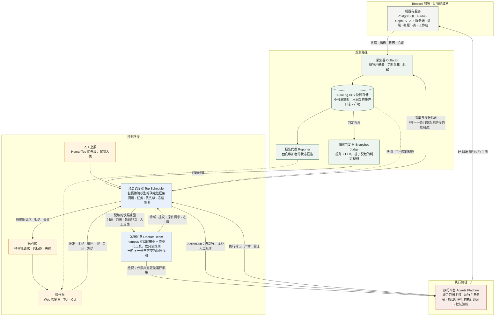

# Broccoli DevOps Agent

[English](./README.md) | 简体中文

这是一个面向 Broccoli 在线评测系统的智能体运维控制平面，用 Rust 编写，自带一套与模型无关的智能体运行框架（harness）。

它加载一份静态的部署拓扑，探测真实端点，构建不可变的快照，接收人工上报，基于一份精确、经脱敏的快照视图派发一个运维任务（由确定性团队或模型驱动的团队执行），把任务提议的操作交给已批准的权限矩阵裁定后送入执行平台，验证其效果，把每一次拒绝和失败放进三类收件箱等待人工处理，把人的反馈作为修订任务送回上游，把一切持久化到磁盘，并在重启后恢复控制状态。一次调查是由若干这样的轮次组成的有界链条：一轮可以只读地检视某个目标，可以请求特定探针并被一个基于新快照的轮次所替代，也可以请求一个后续轮次来检查自己操作的效果——而模型声称的“已解决”只有在调度器能够确认时才算数。机器只会通过你配置的运行手册（runbook）命令被触碰，而且只有在你退出演练模式之后。

**模型提议，运行时记录并强制执行。**

- [快速开始](#快速开始)
- [架构概览](#架构概览)
- [配置](#配置)
- [操作员界面](#操作员界面)
- [工作区布局](#工作区布局)
- [运行 v0.1 切片](#运行-v01-切片)
- [操作与收件箱](#操作与收件箱)
- [观察一次运行及其花费](#观察一次运行及其花费)
- [测试床](#测试床)
- [推荐阅读顺序](#推荐阅读顺序)
- [当前边界](#当前边界)
- [验证](#验证)

完整设计见[架构文档](./docs/architecture.md)（英文），简短导览见[演示概述](./docs/presentation/overview.md)（英文），可编辑的图见 [Excalidraw 源文件](./docs/broccoli-devops-agent-architecture.excalidraw)。

## 快速开始

前置条件：Rust nightly 工具链（`rust-toolchain.toml` 会自动选择；首次构建时 `rustup` 会安装），以及 Node 20+ 和 `pnpm`（用于 Web 控制台）。前两步不需要其他任何东西：不需要模型中继，也不需要真实部署。

### 1. 五分钟体验控制台

生成一个演示数据目录（收件箱的每一类都预先放好了一个事项），用确定性团队提供服务，然后打开 Web 控制台：

```bash
cargo run --example seed_demo -- data-demo
```

```bash
cargo run -- serve --data data-demo --topology data-demo/topology.toml --team readonly
```

```bash
cd web && pnpm install && pnpm dev
```

打开 <http://localhost:5180>。收件箱里有一个待审批请求（批准它，或附评论拒绝）、一个规则拒绝、一个失败的操作和一个失败的任务（知悉它们，或送回上游，看修订轮次带着你的评论运行）。概览页显示最新快照及其观测盲区；“问题与任务”页列出每一轮；“追踪”打开某一轮背后的完整记录。

### 2. 实时观看一轮运行

改为用一个刻意放慢的脚本化模型提供服务。从控制台上报的每个问题都会运行同一段四回合的调查，每两秒一个回合，因此追踪页能看到记录一条条增长，上报表单能看到进度行，“中断”按钮能协作式地停止这一轮：

```bash
cargo run --example live_demo -- data-live
```

```bash
cd web && pnpm dev
```

在控制台上报一个问题，打开它的追踪，在收件箱批准被挂起的队列清空操作，然后点击**导出**，把整个会话保存为一个 JSON 文件。

### 3. 接入你的部署，使用真实模型

```bash
cp config/agent.example.toml config/agent.toml && cp config/topology.example.toml config/topology.toml
```

在 `config/topology.toml` 中填入你的主机、端口和探针，在 `config/agent.toml` 中填入你的模型中继。导出 API 密钥（文件里只写变量名），然后：

```bash
export BROCCOLI_MODEL_API_KEY=...
```

```bash
cargo run -- check-model
```

```bash
cargo run -- snapshot
```

```bash
cargo run -- report --title "Contestants cannot submit" --description "Web submissions time out since 10:12"
```

```bash
cargo run -- inbox
```

```bash
cargo run -- serve
```

执行平台默认处于演练模式：提议的命令只会被渲染并记录，绝不执行，直到你在 `config/agent.toml` 中设置 `dry_run = false`（或在调度器冻结时通过控制台的设置页修改）。运行手册以你在 `[[platform.runbooks]]` 下映射的命令执行；凭据留在你的 SSH agent 中。

### 4. 终端控制台

```bash
cargo run -p broccoli-tui -- --api http://127.0.0.1:4720
```

## 架构概览



同一张图的英文版保存在 [`docs/presentation/architecture.mmd`](./docs/presentation/architecture.mmd)。三条路径：**观测路径**把机器变成不可变的快照；**控制路径**把快照和人工上报变成问题、任务和决策；**执行路径**把经批准的决策变成运行手册命令并验证其效果。调度器的采集请求是唯一一条回指观测路径的箭头；调度器也是唯一创建 ActionRun 的组件，冻结模式正是在这里强制执行的。

## 配置

两个文件，都可以安全提交——都不含凭据：

- `config/agent.toml`（从 [`config/agent.example.toml`](./config/agent.example.toml) 复制）：智能体的输出语言（`[agent] language = "en"` 或 `"zh-CN"`——智能体写出的一切，从事件摘要、拒绝原因到模型的诊断，都用这种语言；进程生命周期内固定不变）、数据目录、拓扑路径、模型中继（`base_url`、`model`、`wire_api`）以及携带 API 密钥的环境变量的**名字**、每次运行的预算（`max_model_turns`、`max_tool_calls`、`max_inspections`、`max_tokens_per_run`）、中继的价目表（`[model.pricing]`，按每百万 token 计）、累计花费上限（`[budget]`）、采集器的节奏（`[collector] snapshot_interval_secs`，默认 120：`serve` 运行期间，启动时采集一次，之后每两分钟一次，在调度器的任何模式下都是如此；设为 0 则关闭），以及 `[agent] max_auto_passes`——每次上报或每次送回上游之后，控制平面在需要人工介入之前自动运行的轮次数（默认三轮：观察、行动、检查）。运行模型驱动的命令前先导出密钥变量。
- `config/topology.toml`（从 [`config/topology.example.toml`](./config/topology.example.toml) 复制）：每一台机器和每一个端点——PostgreSQL、Redis、CephFS/对象存储、API 服务端、前端、判题节点和各类工作站——以及用于观测它们的只读探针：`tcp.connect` 和 `http.status` 检查可达性（带 `degraded_above_ms` 延迟阈值），`redis.llen` 读取队列积压，`http.json` 读取任意无需认证的 JSON 计数器，`broccoli.worker` / `broccoli.queue` 通过 Broccoli 的管理 API 读取判题节点心跳和消息队列深度（与管理后台看到的数据相同），每个探针都带 `min`/`max`/`expect` 健康判据。管理 API 需要一个拥有 `system:view` 权限的登录：运行前导出 `BROCCOLI_PROBE_LOGIN=username:password`；拓扑文件里只写变量名。

`broccoli-devops-agent config show` 以 JSON 打印生效的配置（密钥已脱敏），供前端使用，或用于核对智能体实际采用的值。

## 操作员界面

控制平面暴露一个 HTTP + SSE API（`serve`），两个用户界面都是它的纯客户端——一个进程，两个控制台，没有任何只存在于 UI 的状态：

```bash
# 终端 1：控制平面 API（默认 localhost:4720；见 config/agent.toml 中的 [api]）。
# 启动时先恢复：被中断的工作会被整理进收件箱，上一次的冻结状态会被还原；
# 只有在干净重启之后派发才会自动恢复（--stay-frozen 则永不自动恢复）。
cargo run -- serve

# 终端 2：Web 控制台——纯 React + Vite + Tailwind，样式沿用 Broccoli 自己的
# Web UI（相同的设计令牌、侧栏、卡片、徽标），但不依赖任何 Broccoli 包。
cd web && pnpm install && pnpm dev          # http://localhost:5180，/api 代理到 :4720

# 或者终端控制台。
cargo run -p broccoli-tui                   # --api http://127.0.0.1:4720 --token ...
```

Web 控制台的收件箱分三类——待审批请求（批准，或附评论拒绝）、已拒绝（谁拒绝的、为什么；送回上游或知悉）、失败（任务和操作；同样的两种决定）——此外还有带观测盲区的最新快照、带反馈和记录链接的问题与任务、实时事件流、冻结/恢复控制、运行期间显示实时进度的人工上报表单、正在运行的轮次及各自的“中断”按钮，以及模型中继迄今的花费与上限的对比。每个决定都会记录操作员的名字。

“问题与任务”页是历史：每个问题及其每一轮，可筛选（未关闭、已关闭、归档）、可搜索。它的**追踪**打开的是问题背后的工作流，而不是一个黑盒——轮次链（初始轮次，之后是补充数据的轮次、根据人工反馈修订的轮次、跟进某个操作的轮次），以及所选轮次的逐条记录：输入、每个模型回合及其延迟和 token 数、每次工具调用及其参数和输出（错误、拒绝和不可信数据都会标明）、框架自身的提示，旁边是这一轮的结果、它提议的操作及其矩阵裁定和人工决定，还有问题的事件日志。轮次运行期间记录会一条条实时增长，就像编码智能体的终端一样；结束后由存储的记录接管，逐条一致。**导出**把整个会话——问题、各轮及其记录和模型读过的快照视图、操作、快照和事件——保存为一个 JSON 文件；**导入会话…**把这样的文件作为只读归档载入：它可以像其他问题一样显示和追踪，但每一个控制决策（派发、审批、审阅、关闭、恢复、花费）都会忽略它。命令行上对应的是 `sessions export <issue-id>` 和 `sessions import <file>`。

**设置**页是配置器。它把整份生效配置（令牌已遮蔽，API 密钥只显示存在与否）分三组显示。*运行参数*——快照节奏、每次上报的轮次数、每轮的检视次数、回合数、工具调用数和 token 数、价目表、花费上限——立即生效，作用于下一轮。*策略*——演练模式、命令超时、自动重复窗口、分类列表、运行手册命令——决定真实机器上执行什么，因此只能在调度器冻结时编辑，会以你的名义记录为一条带修改前后值的 `human.settings_changed` 事件，而关闭演练模式需要明确确认。*仅启动时生效*的值（语言、路径、中继、绑定地址、令牌）以只读方式显示：修改文件并重启。每一次被接受的修改都会写回配置文件本身并保留你的注释，因此文件在重启之间始终是唯一的真实来源。控制台自身的语言（English 或简体中文）可在侧栏运行时切换，按浏览器记忆；默认跟随智能体配置的语言。TUI 在终端里覆盖同样的操作：`1-4` 切换屏幕，`j/k` 选择，`a` 批准，`r` 拒绝，`b` 送回上游，`x` 知悉（后三者会提示输入评论），`c` 中断正在运行的轮次，`s` 采集快照，`f`/`F`/`u` 冻结派发、全部冻结、恢复；`--as NAME` 设置记录的操作员名字。它的概览带有同样的活动和花费面板。在绑定到 localhost 之外之前，请在配置中设置 `api.token`（并给 TUI 传 `--token`）。

要在已有的 `serve` 旁边运行脚本化慢速模型，给它另一个端口并把控制台指向它：

```bash
cargo run --example live_demo -- data-live 127.0.0.1:4721
BROCCOLI_API=http://127.0.0.1:4721 pnpm --dir web dev --port 5181
```

## 工作区布局

仓库是一个 Cargo 工作区，包含三个 crate，依赖方向严格：

- **`broccoli-devops-agent`**（根）——控制平面：领域模型、端口、调度器、采集器、存储、执行平台、权限策略、团队、HTTP API 和 CLI。它的端口（`AgentTeamPort`、`SchedulerPolicyPort`、`SnapshotJudgePort`）是与后端无关的接缝，模型驱动的工作都从这里接入。
- **[`crates/harness`](./crates/harness)**（`broccoli-agent-harness`）——我们自己的、与模型无关的智能体循环：类型化的白名单工具、用于结构化输出的终止工具、回合/工具调用/token 预算（带低预算警告和只提供终止工具的收尾回合）、按请求的 token 统计、逐步的进度观测、后端瞬时故障时的退避重试、协作式取消，以及可回放的记录。它对 `ModelClient` 边界是泛型的（OpenAI 兼容的中继客户端位于 `openai` feature 之后），并且对 Broccoli 一无所知。
- **[`crates/tui`](./crates/tui)**（`broccoli-tui`）——终端控制台，API 的纯 HTTP 客户端。
- **[`web/`](./web)**——Web 控制台（React 19 + Vite + TypeScript + Tailwind v4），同样是纯 API 客户端，由 Vite 单独提供服务。它复刻了 Broccoli 的 Web UI——相同的颜色令牌、侧栏导航、卡片、徽标和页头——让操作员在评测系统的管理页面和控制台之间切换时没有视觉断裂，同时不与 Broccoli 的插件系统共享任何代码。

控制平面依赖 harness，反之绝不；两个 UI 只依赖 API。模型驱动的集成只在端口处与调度器相遇：今天由 `team::HarnessOperateTeam` 把 `AgentTeamPort` 适配到 harness 上，而一个直接实现同一端口的 codex 驱动团队是计划中的第二个选项——调度器分不出它们的差别。

模型驱动的团队每轮拿到六个工具：`read_snapshot_view`、`inspect`（对范围内目标执行 `service.status` 或 `log.tail` 之类的非变更运行手册，经由执行平台，输出作为不可信数据围栏返回）、`request_probes`（结束本轮；一份带这些探针的新快照开启下一轮）、`report_progress`、`propose_action` 和 `submit_diagnosis`（`diagnosis_only` 或 `solved`，可选地在提议执行完毕后请求一个后续轮次）。之后的每一轮都在视图中携带先前各轮——提议、矩阵裁定、执行和验证结果。整条链由 `max_auto_passes` 限界，一旦有事项等待人工就停下，并从批准或送回上游处继续。

## 运行 v0.1 切片

```bash
# 1. 描述你的部署（主机、端口、探针、依赖）。
cp config/topology.example.toml config/topology.toml

# 2. 采集并显示一份快照及其观测盲区。
cargo run -- snapshot

# 3. 上报一个问题；一个运维任务基于快照视图进行诊断。
#    config/agent.toml 中有 [model] 段且密钥已导出时，使用 harness 驱动的模型团队；
#    否则运行确定性团队。用 --team 可强制指定任一种。
cp config/agent.example.toml config/agent.toml       # 一次即可；按需修改 base_url/model
export BROCCOLI_MODEL_API_KEY=...                     # 永远不要把密钥写进文件
cargo run -- check-model                              # 与中继做一次往返
cargo run -- report --title "Contestants cannot submit" \
    --description "Web submissions time out since 10:12"
cargo run -- report --team readonly --title "..." --description "..."

# 4. 模拟控制器重启并恢复控制状态。
cargo run -- recover

# 5. 查看只追加的事件日志。
cargo run -- events --tail 20
```

状态保存在 `./data/` 下（用 `--data` 覆盖）：每个快照、问题、任务和产物记录各一个 JSON 文档，产物正文在 `data/artifact-bodies/` 下，外加一个只追加的 `data/events.jsonl`。人工上报默认使用为人类保留的最高优先级；传 `--priority low|normal|high|critical` 可以降低。

## 操作与收件箱

当任务提议操作时，`report` 会把每一项交给已批准的权限矩阵（[docs/action-authority.md](./docs/action-authority.md)，编码在 `src/policy.rs` 中）裁定：`auto` 行经执行平台执行并立即对照采集后的快照验证，`approve` 行在**待审批请求**收件箱中等待，`deny` 行被取消，规则的理由保留在 ActionRun 上并在**已拒绝**收件箱中等待。人工的拒绝连同其评论一起进入同一个已拒绝收件箱。失败的任务，以及执行或验证失败的操作，在**失败**收件箱中等待。被拒绝或失败的事项有两种审阅方式：*知悉*它，或者*送回上游*——智能体随后会基于新快照运行一个修订任务，把拒绝原因、失败摘要和你的评论摆在面前，而它的新提议会再次经过矩阵裁定（[docs/architecture.md §4.10](./docs/architecture.md)）。

```bash
cargo run -- inbox                                            # 三类事项
cargo run -- actions approve <id> --as alice                  # 执行并验证一个等待中的操作
cargo run -- actions reject <id> --as alice --comment "..."   # 取消它；评论随之保留
cargo run -- review action <id> --upstream --comment "..."    # 修订任务立即带着反馈运行
cargo run -- review job <id> --acknowledge                    # 记录在案；不再自动处理
cargo run -- issues close <id> --resolved --comment "..."     # 或 --cancelled / --failed
cargo run -- actions list                                     # 每个 ActionRun 及其拒绝、证据、审阅
```

授权是对整个提议做出的裁定：运行手册、每个目标的类型（判题节点重启不能指向 API 服务端）、任务的目标范围和能力、参数——然后才是矩阵行。每一次状态转换都是比较并交换（compare-and-set），幂等键被原子地占用（与仍在进行的操作重复会被拒绝；失败后的重试被允许，但会升级为需要审批），超时的命令会连同整个进程组一起被杀掉，然后才报告失败。验证按操作类别进行且分等级：效果被观测到发生变化为 `strong`，目标本来就健康为 `weak`，什么都没执行为 `dry_run`——只有真实证据才能解决一个问题；否则问题会等待人工关闭。

执行平台把运行手册作为你在 `config/agent.toml` 的 `[[platform.runbooks]]` 下映射的命令来执行（例如 `ssh {target} sudo systemctl restart broccoli-worker`）；凭据留在你的 SSH agent 中。它从**演练模式**启动——命令只被渲染并记录为产物，不会执行——直到你设置 `dry_run = false`。验证把命令的零退出码仅视为一条证据：目标必须在采集后的快照中处于健康状态，否则操作以 `VerificationFailed` 结束。

## 观察一次运行及其花费

模型驱动的一轮是几次缓慢且花钱的远程调用，所以控制平面在它还在进行时就报告这两件事。

**进度。** 智能体循环会在每个模型回合、工具调用、重试和预算收尾发生时立即宣布；这些行与模型自己的 `report_progress` 汇成一条有序的流，变成团队回调和 `team.callback` 事件，通过既有的 SSE 通道到达每个控制台。Web 控制台在请求仍在进行时就在上报表单上实时显示它们，事件页流式显示全部，TUI 的概览显示最新一行及产生它的轮次，CLI 的 `report` 则在它们到达时打印到 stderr。

**中断。** 正在运行的轮次按任务 ID 注册，可以被停止：Web 控制台的“中断”按钮、TUI 里的 `c`、`POST /api/jobs/{id}/cancel`，或 `report` 运行期间的 Ctrl-C。取消是协作式的——团队在下一个步骤边界停下，仍会交付最终回调，因此记录得以保留，任务进入失败收件箱等待人工送回上游，而不是随进程一起消失。

**Token 与费用。** 每个后端响应的 `usage` 块都会被解析（两种线路格式都支持），按运行累加，记录在任务上并作为 `model.usage` 事件写入，再从这份只追加的日志中汇总。费用从不存储——它们按需由数量和 `[model.pricing]` 推导，因此价目表变更后历史会被正确地重新计价，而没有价目表的部署仍能得到完整的 token 统计。不报告用量的中继会被计为一次 token 数*未知*的请求，而不是免费的请求，每个数字都会如实说明。

```bash
cargo run -- usage          # 总量、按模型、与上限对比
```

**预算。** `max_tokens_per_run` 限界一轮：它通过与回合和工具调用预算相同的收尾路径停止，因此因费用而停止的运行仍以结构化结果结束。`[budget]` 限界整个部署：达到 `max_total_tokens` 或 `max_total_cost` 会冻结调度器（恢复流程会在重启之间保留这个冻结），并拒绝新的上报，直到上限被调高且有人手动恢复。

## 测试床

[`testbed/`](./testbed) 启动三台 OrbStack Linux 机器——`infra-1`（PostgreSQL、Redis、SeaweedFS）、`app-1`（`broccoli-server` 及其提供的前端）和 `judge-1`（一个判题节点）——每台都有自己的 Docker 引擎，因此控制平面观测和操作的是跨真实主机的真实服务，而不是本机端口。控制器留在 Mac 上，与比赛时一致。

```bash
testbed/01-create-machines.sh && testbed/02-install-docker.sh
testbed/03-build-images.sh                        # 在 app-1 上构建 Broccoli
testbed/04-deploy-infra.sh && testbed/05-deploy-app.sh && testbed/06-deploy-judge.sh
testbed/07-verify.sh                              # 注入故障，断言智能体的结论
```

用 `--config config/agent.testbed.toml` 驱动智能体对接测试床，它把状态保存在 `data-testbed/` 中，并以 `dry_run = false` 运行执行平台：ActionRun 会通过 `testbed/runbook.sh` 真正重启容器。判题节点和队列通过 Broccoli 的管理 API 观测，所以先导出测试床的管理员登录：

```bash
export BROCCOLI_PROBE_LOGIN="$(bash -c 'source testbed/lib.sh; echo "$ADMIN_USER:$ADMIN_PASSWORD"')"
```

[`testbed/scenarios/`](./testbed/scenarios) 每次注入一个已知故障——停掉一个服务、隔断两台主机、拖慢一个存储卷——它们经过挑选，有的探针能看见，有的看不见，而这恰恰是智能体必须如实说出来的。

## 推荐阅读顺序

1. `src/domain/`：从 Snapshot、Issue、Job、ActionRun、Artifact 和 EventLog 开始；`review.rs` 保存拒绝、审阅和送回上游的反馈；`trace.rs` 保存实时追踪的步骤。
2. `src/ports.rs`：了解采集器、快照判定器、智能体团队（回调接收端和取消）、执行平台、调度策略、报告代理和存储周围的边界。
3. `src/scheduler.rs`：看 AI 集成的顶层调度器如何接收人工上报、请求快照采集、通过策略模型（带确定性回退）分诊候选、创建和替代任务、处理回调、把关 ActionRun，以及管理冻结/恢复。
4. `src/topology.rs` 和 `src/collector.rs`：静态部署图，以及 `CollectorPort` 之后由探针驱动的采集器。
5. `src/view.rs`：脱敏的快照视图构建器和按内容哈希寻址的产物存储。
6. `src/team/`：确定性的只读运维团队和 harness 驱动的 `HarnessOperateTeam`——同一个 `AgentTeamPort` 之后的两个后端。
7. `crates/harness/src/`：智能体循环（`agent.rs`）、工具注册表（`tool.rs`）和 `ModelClient` 边界（`client.rs`）。
8. `src/store/file.rs`：让重启恢复成为现实的文件存储（`src/store/memory.rs` 保留给测试）。
9. `src/runner.rs` 和 `src/main.rs`：装配、轮次链（`drive_passes`）、收件箱投影、审阅流程和操作员 CLI；`src/session.rs` 负责会话导出与导入；`src/settings.rs` 负责配置器的三类值。
10. `src/api.rs`、`crates/tui/` 和 `web/src/`：HTTP + SSE API 及其两个控制台。

代码标识符和全部文档都用英文书写。文档注释着重说明一个条目为何存在、未来的决策应落在何处，而不是简单重复它的名字。

## 当前边界

v0.1 切片有意不实现：

- 模型驱动的调度器决策：harness、其 OpenAI 兼容客户端和 harness 驱动的运维团队都已实现并接到中继上，但调度策略和判定器适配器尚未接入，因此调度器的每个决策点仍运行保守的确定性回退。
- 开箱即用的真实机器变更：执行平台只执行你配置的运行手册命令，并且在你选择退出之前一直处于演练模式。
- 跨对象事务：每次文档写入都是原子的，每次更新都是比较并交换，但两条记录之间的崩溃由启动恢复来整理，而不是被阻止。
- 通过快照判定器自动接收事件以及持续的自主排障：快照按计划采集，但上报仍由操作员触发。
- 需要认证的 PostgreSQL、Redis 或对象存储探针：探针注册表读取的是明文 TCP、明文 HTTP、明文 Redis 协议和 Broccoli 的管理 API。
- SQLite（文件存储保持同样的 `StateStore` 契约，可直接替换）。
- 报告代理的实现，或团队内部的并行子智能体（`ReporterPort` 边界已预留）。
- 真实的 Worktree、WASM 或 Bundle 构建与替换。

需要未接入端口的调度器操作会以明确的 `MissingDependency` 错误失败，而不是假装某个外部能力存在。

## 验证

```bash
cargo fmt --check
cargo check --all-targets
cargo test
cargo clippy --all-targets -- -D warnings
RUSTDOCFLAGS="-D warnings" cargo doc --no-deps
```
