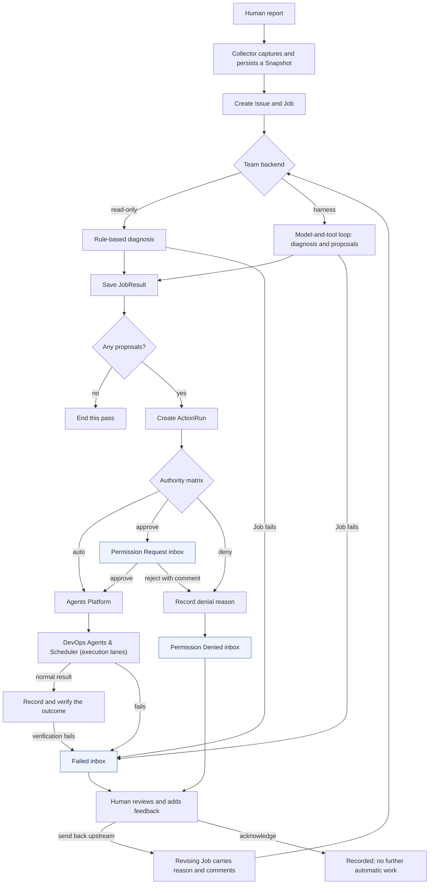

# Broccoli DevOps Agent Architecture

> Status: Draft v0.6  
> Updated: 2026-09-05  
> Scope: Product and system architecture. This document does not yet prescribe a concrete OpenAI model, deployment host, or production permission policy.  
> v0.3 applied the first design-feedback round (`docs/fable-design-feedback.md`): the separate Work Order layer is gone, the inbox has three categories, denials carry reasons and comments, and a human review can send an item back upstream as a revising Job.  
> v0.4 applies the second review (`docs/remaining-issues-d805bf1-zh-en.md`): joint scope authorization, idempotency claims and compare-and-set transitions, process-group kill on timeout, startup recovery with reconciliation, derived Issue status with explicit closure, class-specific verification evidence and business probes, and execution evidence in upstream feedback. See §12 for the design choices that review asked to align on.  
> v0.5 gives the Operate Team a real investigation loop (§4.5): passes that request Probes and are superseded, follow-up passes over the after-Snapshot, read-only inspections through the Platform, a pass budget, and a Scheduler-checked "solved"; and hardens the harness (§11 OD-5) with budget warnings, wrap-up turns, and transient-failure retries.  
> v0.6 adds context history (§4.8): a live, entry-by-entry trace of every pass, per-turn records in the transcript, and session files that export an Issue with its whole pass chain and import it elsewhere as a read-only archive.

## 1. Goal

Broccoli DevOps Agent is an operator-facing control plane for deploying,
observing, troubleshooting, and repairing a Broccoli online judging system.

The system must be useful during a real contest before it is useful as a course
demonstration. The course constraint is that the harness and orchestration layer
are implemented in Rust.

The Agent is not part of Broccoli's contestant request or judging data path.
Broccoli must continue serving contestants and processing submissions if the
Agent, the operator UI, or the OpenAI API becomes unavailable.

## 2. Agreed Design Principles

1. **Snapshot-based reasoning.** Every dispatched Agent job is based on one
   immutable Snapshot. A running job does not silently observe later system
   state.
2. **Global coordination, scoped execution.** The Top Scheduler owns global
   priority, issue, job, conflict, and callback context. Agent Teams receive a
   sanitized view of a specific Snapshot that carries the problem statement,
   the scope they were granted, and any human feedback from earlier passes —
   nothing else.
3. **One execution gateway.** SSH credentials and machine mutation live in the
   Agents Platform. Neither the Scheduler nor model prompts directly hold
   credentials.
4. **Human reports have the highest priority.** Human-reported problems bypass
   anomaly detection and enter the Scheduler directly. `HumanTop` priority is
   the default for a human report and is reserved for humans: a reporter may
   deliberately file at a lower priority, but no model or Judge output can ever
   reach `HumanTop`.
5. **Immutable evidence and replayability.** Snapshots, events, model inputs,
   callbacks, actions, and artifacts are recorded so that an incident can be
   replayed and reviewed after a contest.
6. **Separate operation from development.** Operate Teams troubleshoot and
   change deployed systems. Develop Teams modify Broccoli source, plugins,
   WASM, and release bundles in issue-scoped worktrees.
7. **The model proposes; the runtime records and enforces.** Model output is not
   authoritative machine state. The Rust runtime owns IDs, state transitions,
   permissions, action execution, and verification.
8. **Untrusted operational input remains data.** Logs, filenames, compiler
   output, contestant input, and plugin-provided text cannot become executable
   instructions merely because they appear in model context.

## 3. Architecture Overview


The architecture has three main paths.

### 3.1 Observation path

```text
Machines
   │ data / logs / status / events
   ▼
Collector  <── capture / probe requests ── Top Scheduler
   ├──> AutoLog DB / Snapshot Store
   ├──> Snapshot Judge (sanitized Judge View)
   └──> Reporter Agent
```

The Collector runs its own periodic capture schedule. In addition, the Top
Scheduler — and only the Top Scheduler — can request captures on demand: after
a human report, when a Team requests additional Probes, and immediately before
and after an ActionRun. This control edge is the only arrow pointing back into
the observation path; nothing else drives the Collector.

The Collector gathers information from:

- Infra services: PostgreSQL, Redis, and object storage.
- Frontend, API server, and optional gateway.
- Judge workers and their isolate sandboxes.
- Printer Stations and Balloon Stations.
- Representative contestant-network vantage points when configured.

The Collector is responsible for collection, normalization, timestamps,
freshness, redaction metadata, and evidence storage. It does not decide how to
repair a problem.

### 3.2 Control path

```text
Snapshot Judge ──> issue candidate ──┐
                                     ▼
Human Report ────> TOP PRIORITY ──> Top Scheduler
                                     │
                                     │ Snapshot View (problem, scope, feedback)
                                     ▼
                                  Agent Team
                                     │
                                     │ callback / options / artifacts / blockers
                                     ▼
                                 Top Scheduler
                                     │
                                     │ denial / failure ──> Inbox ──> human review
                                     │                                   │
                                     └──────── revising Job <── feedback ┘
```

There is no separate work-order layer. An Issue says what is wrong; a Job is
one bounded pass by one Team over one Snapshot View. The View itself carries
the problem statement (the report's title and description, fenced as untrusted
text), the Job's scope, the human feedback that reached the Issue so far, and
every earlier pass of the same investigation — what it concluded, what it
proposed, how that was decided, what running it produced — so the Team's whole
input is one replayable Artifact. An Issue is normally worked in a short chain
of such passes (§4.5, "The investigation loop").

The component labelled `Judger Agent` in the diagram is an anomaly-analysis
component, not a Broccoli judge worker. This document calls it the **Snapshot
Judge** to avoid that name collision.

The Snapshot Judge examines one immutable Snapshot — through a sanitized Judge
View, see §4.3 — and emits zero or more issue candidates. A candidate is not
automatically a formal Issue. The Top Scheduler deduplicates it, compares it
with active Issues, assigns priority, and decides whether work should be
dispatched.

Human reports bypass the Snapshot Judge. The Scheduler attaches a recent or
newly requested Snapshot (via its capture-request edge to the Collector) before
dispatching work for the report.

### 3.3 Execution path

```text
Top Scheduler
      │ dispatch
      ▼
Agent Team
      │ scoped platform request
      ▼
Agents Platform
      │ controlled SSH / config / service / UFW / Git / build / replacement
      ▼
Machines and repositories
```

The Agents Platform has the network reach and credentials needed to access all
configured machines. Individual Jobs receive narrower capability and target
scopes. All side effects are represented by an ActionRun and are written to the
event log.

Read-only scoped requests (inspection within the Job's capability and target
scope) may flow from a Team to the Platform directly — implemented as the
**inspection gateway**: a running Team asks for a non-mutating Runbook (a
status query, a log tail, an allowlisted read-only database query) on targets
in its scope; the Scheduler checks the freeze mode and the joint scope, the
Platform re-checks and refuses any runbook whose class mutates, the output is
an Artifact and an event, and the Team reads a sanitized tail of it fenced as
untrusted data. No matrix decision, no approval, no ActionRun: nothing
changed. Mutations may not flow this way: a Team returns an ActionProposal,
and only the Scheduler converts it into an ActionRun and hands it to the
Platform, checking the freeze mode at both steps.

Inside the Agents Platform sits the execution block the diagram labels
**DevOps Agents & Scheduler**: the per-target executors that run one Runbook
on one host, and the lane scheduler that serializes executions per resource so
two approved actions never operate on the same machine at once. Approved and
automatically allowed actions enter that block; its normal result is recorded
as the execution outcome, and its failures are routed to the Failed inbox
(§4.10), separately from permission requests and denials.

## 4. Components

### 4.1 Collector

Responsibilities:

- Collect API health, metrics, logs, service state, machine state, and events.
- Assign observation timestamps and freshness.
- Preserve source and trust metadata.
- Store large or raw data as artifacts rather than embedding it in every
  Snapshot.
- Build immutable Snapshots on periodic or event-driven triggers.

For v0.1, the Collector and Snapshot Builder may be one Rust subsystem. They do
not need to be separate processes.

#### Probe Registry (implemented)

Four unauthenticated read-only probes exist, each configured per resource in
the topology file:

| Probe | Reads | Publishes |
| --- | --- | --- |
| `tcp.connect` | reachability and latency of `host:port` | `probe.tcp.connect.latency`; `Degraded` above `degraded_above_ms` |
| `http.status` | status code of a plain-HTTP `GET` | latency as above |
| `redis.llen` | the length of one Redis list (queue backlog) over the plain protocol | the metric named by `metric` (default `queue.depth`); `Degraded` outside `[min, max]` |
| `http.json` | one value at a JSON `pointer` in a plain-HTTP `GET` response | the numeric value as a metric; `expect` for exact matches; `Degraded` outside `[min, max]` |
| `broccoli.worker` | one worker's heartbeat from Broccoli's admin API (`/api/v1/admin/system/workers`, the admin dashboard's data), matched by `worker_id` (default: the resource ID) | `Healthy` on a live heartbeat, `Degraded` when stale, `Down` when absent; `worker.in_flight`, `worker.heartbeat_age`, `worker.max_concurrency`; version and host as fenced facts |
| `broccoli.queue` | one MQ queue's depth from the admin overview (`/api/v1/admin/system/overview`) | `queue.depth` (or `metric`), plus `broccoli.submissions_in_progress` and `broccoli.dlq_unresolved`; `Degraded` outside `[min, max]` |

Four probes are unauthenticated reads. The two Broccoli probes need a login
with `system:view`: the topology names the environment variable (`login_env`,
default `BROCCOLI_PROBE_LOGIN`, value `username:password`) and the Collector
logs in once per server, caching the JWT and re-logging in on a 401. A worker
has no inbound port, so its heartbeat — written to Redis every 5 s and read by
the server — is the only honest observation of it; without the probe it is
`Unknown` with a coverage gap, never assumed healthy. "Reachable but backed
up" is therefore a visible state, and verification can require a business
postcondition (§6.3) rather than an open port.

### 4.2 AutoLog DB / Snapshot Store

Responsibilities:

- Append-only event history.
- Immutable canonical Snapshots.
- Scheduler and Job checkpoints.
- References and hashes for large artifacts.
- Recovery after controller restart.
- Post-contest review and incident replay.

The first implementation may use SQLite for indexed control state and event
metadata, with large logs, diagnostic bundles, patches, WASM, and release
bundles stored as files referenced by content hash.

### 4.3 Snapshot Judge

The Snapshot Judge is hybrid (decided; formerly OD-3): deterministic alert
rules always run, and an LLM additionally correlates evidence across components
and proposes issue candidates the rules cannot express.

Responsibilities:

- Examine one Snapshot at a time.
- Run deterministic alert rules unconditionally; rule output does not depend on
  model availability.
- Use model reasoning for cross-component correlation on top of the rules.
- Emit issue candidates with evidence references and a deduplication key.
- Never dispatch teams or mutate machines directly.

Because model reasoning is involved, the Judge does not read the canonical
Snapshot. It consumes a **Judge View**: a sanitized rendering built by the
Snapshot View Builder with the Judge's own redaction profile, stored as an
Artifact exactly like a Job's Snapshot View. This keeps raw untrusted text
(log excerpts, contestant-derived strings, alert bodies) out of model context
and makes every Judge inspection replayable byte-for-byte.

### 4.4 Top Scheduler

The Top Scheduler is the only component with global orchestration ownership.
It is AI-integrated: a **deterministic harness** wrapped around a **Scheduler
Policy model**. The harness owns every invariant; the model handles judgment
calls, edge cases, and unforeseen situations — but only as proposals.

#### Control flow

Every Scheduler cycle follows one explicit loop:

```text
input (snapshot | issue candidate | human report | team callback | human choice | timer)
   │
   ▼
deterministic pre-checks        mode gates, state machines, dedup keys, scope
   │
   ▼
policy consultation             ONLY at fixed decision points, typed request/response
   │
   ▼
harness validation              clamp priorities, verify references and transitions,
   │                            check conflicts; invalid proposals are errors
   ▼
apply + append events           model input and output stored for exact replay
```

The fixed decision points where the policy model is consulted:

1. **Candidate triage.** Accept, merge into an existing Issue, or reject an
   issue candidate, with a proposed priority. The harness clamps every
   model-proposed priority below `HumanTop` and verifies merge targets exist
   and are open.
2. **Callback interpretation.** After a Job's final result: request a
   resnapshot with specific Probes, convert selected Team proposals into
   ActionRuns, ask a human a concrete question, resolve, or give up. The
   harness validates the proposal against the actual `JobResult` (probe lists
   non-empty, proposal indexes in range) and refuses invalid decisions rather
   than executing them.

Hard invariants never route through the model: freeze modes, approval gates,
state-machine transitions, capability and target scoping, `HumanTop`
reservation, and idempotency. Every consultation is written to the EventLog
with its exact input and output (mixed trust) so post-contest review can audit
each model-influenced decision.

**Authority is decided over the whole proposal.** Before the matrix row
applies, the Scheduler validates the runbook, every target's kind against the
operation class's allowed kinds (a worker restart pointed at the API server is
denied, not approved under the worker row), every target against the Job's
target scope, the class's capability against the Job's capabilities, and the
runbook's required arguments for presence and shell safety. Any failure is a
denial whose rationale names the failed check. The Platform re-checks the
machine-side half (target kinds, arguments) before it runs anything.

**Every transition is a compare-and-set.** Approval, rejection, execution
start, execution result, verification, review, and Issue changes are written
only if the stored record still equals the one the caller read; otherwise the
caller gets `Conflict`. Two operators approving one action, or a retry racing
its original, cannot both apply. The idempotency key is claimed under the
store's lock before a proposal is admitted: while another ActionRun with the
same key may yet run, is running, or succeeded, the new one is denied as a
duplicate; a failed or cancelled run releases its key so a retry is possible —
and the repeat rule then escalates that retry to approval.

**Fallback:** when the policy model is unavailable, decision points degrade to
conservative deterministic defaults — candidates are recorded and deferred to a
human, and next steps become a question for a human. Model downtime therefore
never breaks collection, persistence, dispatch bookkeeping, or recovery.

The human report path itself involves no policy consultation: a report
triggers a Snapshot capture, the Issue and Job are created, the selected Team
backend runs, and the diagnosis and proposals are saved in `JobResult`. If
there are no proposals the pass ends there; if there are, each becomes an
ActionRun and the authority matrix decides its fate (§4.10).

#### Responsibilities

- Maintain formal Issues and their priorities.
- Give Human Reports the highest effective priority by default.
- Request on-demand Snapshot captures from the Collector (the only component
  besides the Collector's own schedule that can).
- Select a base Snapshot for every Job.
- Generate a sanitized Snapshot View.
- Dispatch Develop or Operate Jobs.
- Aggregate callbacks, options, artifacts, and blockers.
- Manage human choices, including the inbox: park denied and failed work for
  review and turn a human's "send back upstream" into a revising Job that
  carries the feedback.
- Act as the sole gateway that creates ActionRuns and hands them to the Agents
  Platform (this is where freeze modes are enforced).
- Detect Worktree, source, configuration, Bundle, target-machine, and operation
  conflicts.
- Freeze, resume, checkpoint, and recover orchestration.
- Supersede stale Jobs with Jobs based on newer Snapshots.

`Freeze` refers to workflow control, not Snapshot immutability and not an
implicit shutdown of Broccoli. A frozen Scheduler can stop new dispatches while
Broccoli and the Collector continue running.

### 4.5 Agent Teams

#### Develop Team

- Hotfixes and feature requests.
- Broccoli source changes.
- Plugin and WASM changes.
- Release Bundle construction.
- Tests and alternative solution proposals.
- One primary development worktree per Issue.

Develop output is not installed merely because an Agent produced it. Options
return to the Scheduler, human choice is recorded when required, and selected
changes pass conflict checking before an artifact replacement ActionRun.

#### Operate Team

- Deployment troubleshooting.
- Configuration changes.
- Service inspection and control.
- Network and UFW operations.
- Storage, database, Redis, worker, and station troubleshooting.
- Post-action verification and callback.

The exact automatic-write boundary differs by operation mode and remains an
open decision.

#### Team contract

A Team reports through a callback sink, not a single return value: zero or
more interim callbacks (progress, probe requests, human questions) followed by
exactly one callback carrying the final result. The callback's kind is derived
from its content, so a Team cannot label a failure as success. Each running Job
carries a cooperative cancellation signal; supersession, freezing, or human
cancellation signals the Team, which stops at a safe point and still delivers a
final callback describing what was abandoned. A Team backend that errors out
without a final callback is not left running: the runtime records the error as
a `Failed` result, so the Job lands in the Failed inbox.

Two backends implement the Operate contract today: the **read-only backend**
(rule-based diagnosis from the View, never proposes) and the **harness
backend** (a model-and-tool loop that produces a diagnosis, action proposals,
or a probe request). Both receive human feedback the same way — it is in the
View — and both must visibly take it into account on a revision pass: the
read-only backend prefixes its diagnosis with the feedback it saw, the harness
backend presents it to the model as trusted operator direction alongside the
fenced View.

#### The investigation loop

A pass reasons over one immutable Snapshot; the harder situations — evidence
that is not in the Snapshot, a remediation whose effect must be checked before
the next step — are handled by chaining passes, never by letting a running Job
read live state. The runner drives the chain; the Scheduler dispatches and
records every step; the Team sees the whole chain in its View under
`earlier_passes`.

```text
pass k over Snapshot k
   ├─ NeedsMoreData (probe request)  → capture Snapshot k+1 with the requested Probes
   │                                   → superseding pass k+1 (supersedes_job_id)
   ├─ diagnosis + proposals          → ActionRuns through the matrix
   │     ├─ something waits for a human (approval, denial, failure) → chain stops; inbox
   │     ├─ follow_up requested, every proposal executed or denied,
   │     │  budget left                → follow-up pass k+1 over the newest after-Snapshot
   │     │                                (continues_job_id)
   │     └─ otherwise                 → chain stops
   └─ Solved / diagnosis, no proposals → chain stops
```

Rules the runtime enforces, not the model:

- **Pass budget.** `[agent] max_auto_passes` bounds the passes run without a
  human per human report or per send-upstream review (default three: observe,
  act, check). Each pass carries `follow_up_budget`, the passes still grantable
  after it; at zero the Team is told it is the last automatic pass and the
  probe-request tool is not offered at all. A non-harness Team that still
  returns `NeedsMoreData` at zero budget stalls in the Failed inbox, where a
  human can send it back upstream — which starts a new chain with a fresh
  budget, exactly like any other send-back.
- **One pass, one Snapshot.** A probe request cannot follow a proposal in the
  same pass, and `solved` cannot be claimed while proposals are pending: the
  adapter refuses both, so the model either acts now or gathers more evidence.
- **Follow-up only after settlement.** A follow-up pass runs only when every
  proposal of the pass has been executed or denied; a held action stops the
  chain and the human's approval resumes it (the approval executes, verifies,
  and — if the pass asked for one — dispatches the follow-up before returning).
  When every proposal was denied nothing ran, so nothing is re-observed.
- **"Solved" is a claim.** The Scheduler accepts a `Solved` result only when an
  ActionRun on the Issue succeeded with real (Weak or Strong, never dry-run)
  evidence and every resource the Issue touches — its affected resources plus
  every action target — is present and Healthy in the pass's own Snapshot.
  Otherwise the result is recorded as `DiagnosisOnly` with the reason among
  its unresolved questions and a `scheduler.result_clamped` event, and a human
  decides. A rehearsal in dry-run mode therefore never resolves an Issue on a
  model's word, and neither does a first pass that saw nothing wrong.

The harness backend's tools are exactly these: `read_snapshot_view`,
`inspect` (the gateway above, at most `[model] max_inspections` per pass, only
runbooks that both have a configured command and classify as non-mutating),
`request_probes` (terminal; Probe IDs from the Probe Registry on in-scope
targets), `report_progress`, `propose_action` (runbooks from the Runbook
Registry, optional verification Probes), and `submit_diagnosis` (terminal;
`diagnosis_only` or `solved`, plus `follow_up`). Every tool is allowlisted per
run; the transcript of every pass is a DiagnosticBundle Artifact.

#### Internal parallelism

An Agent Team may later use skills or subagents to investigate independent
subtasks. Those internal agents share the Job's Snapshot View and report to the
Team, not separately to the Top Scheduler. This is an optional implementation
detail, not a required v0.1 component.

### 4.6 Agents Platform

Responsibilities:

- Own SSH and other machine credentials.
- Validate Job capability and target scopes.
- Execute controlled service, configuration, UFW, Git, build, and artifact
  operations.
- Apply idempotency keys, timeouts, cancellation, and output limits.
- Emit ActionRun events and artifacts.
- Support before/after Snapshot verification.

The Platform may internally use system OpenSSH or another transport, but that
choice is not exposed to Agent prompts.

The Platform's execution block (the diagram's **DevOps Agents & Scheduler**)
is explicit in the implementation: `LocalCommandPlatform` renders one command
per target from the operator's Runbook templates, holds a per-resource
execution lane for every target (acquired in sorted order, so multi-target
actions cannot deadlock), runs the per-target executors in sequence, and
stores the complete output as an `ActionOutput` Artifact, registered in the
store so its ID resolves through the Artifact API. A refusal — unknown target,
wrong target kind for the Runbook, unconfigured Runbook, an argument with shell
metacharacters — is a failed result, never an exception, so it reaches the
Failed inbox with its reason.

The same executor serves inspections (§3.3): the Platform validates the
request exactly as it validates an ActionRun and additionally refuses any
runbook whose operation class is mutating, so a Team cannot restart a service
by calling it an inspection; the output is an ActionOutput Artifact produced
by the Job, and the inspection takes the target's execution lane so a log read
never interleaves with a restart of the same machine.

Each command runs in its own process group with a wall-clock limit. On timeout
the whole group receives `SIGKILL` and the child is reaped before the result
is reported and the execution lanes are released, so a "failed" action never
means "still running and changing the machine". Output is captured
concurrently and capped per stream. A Platform that errors out instead of
reporting a result is recorded by the Scheduler as a failed execution, and an
after-Snapshot that cannot be captured is recorded as a failed verification:
an ActionRun is never left `Running` or `Verifying` with nobody responsible.

### 4.7 Reporter Agent

The Reporter (decided; formerly OD-6) is a first-class component fed by the
Collector and Snapshot Store, matching the architecture diagram. It summarizes
machine and service status for the human maintainer.

Responsibilities:

- Consume Snapshots from the observation path; never dispatch work or mutate
  machines.
- Render status reports deterministically first; model summarization is an
  optional layer on top of the deterministic rendering.
- Store each report as a `StatusReport` Artifact.

The Reporter is not part of the v0.1 vertical slice, but its boundary
(`ReporterPort`) is reserved now so the observation path does not need
restructuring later.

### 4.8 Operator interfaces

The control plane exposes an HTTP + SSE API (`src/api.rs`) bound to localhost
by default and optionally protected by a bearer token. Two consoles are pure
clients of it and hold no state of their own: a web console (`web/`, plain
React + Vite + Tailwind, deliberately independent of Broccoli's plugin system
for now, but styled with Broccoli's own design tokens and layout — sidebar,
page headers, cards, badges — so it reads as part of the same operator
tooling) and a terminal console (`crates/tui`, ratatui). Everything a console can do —
file a report, approve or reject a held action, capture a Snapshot, freeze or
resume the Scheduler — is an API call onto an existing runner operation, so the
authority matrix and the event log apply to UI actions exactly as to CLI ones.
Language is two settings, deliberately. The agent's output language (`[agent]
language`, `en` or `zh-CN`) is fixed for the life of the process: every event
summary, denial rationale, verification and execution summary, Team diagnosis,
and the feedback text the model reads comes out in it, and the model is
instructed to write its diagnoses in it while identifiers stay untouched. The
log therefore never switches language mid-incident and transcripts replay as
written. The consoles translate their own chrome at runtime, per viewer,
defaulting to the agent's language.

The inbox is the console's centre, in its three categories (§4.10): permission
requests are decided with the Team's reason and expected effect in view;
denials show who refused and why, take a comment, and can be sent back
upstream or acknowledged; failures show the Job's or Platform's summary and
take the same two decisions. Every decision records the human's name.

#### Context history: traces and session files

The consoles are not a window onto a black box. Three mechanisms make the
actual workflow observable and portable:

- **Live trace.** The harness's observer sees every transcript entry the moment
  it is appended, inputs included. The Team adapter forwards each one to the
  Scheduler as a progress callback carrying a `TraceStep` (the entry's index,
  time, and item, with long text cut to a preview), and the Scheduler records it
  as a `team.step` event bound to the Issue and Job — nothing else happens to it.
  The console's Trace page shows the transcript growing from these events while
  the pass runs and switches to the stored transcript when it ends; the two line
  up entry for entry. Delivery runs alongside the agent loop, never inside it, so
  writing an event cannot hold a model call back. The harness's `TraceStep`
  never crosses a port: it travels as the JSON the stored transcript contains.
- **Per-turn records.** The transcript now carries one `TurnRecord` per model
  request — when it was issued and answered, its token usage, the retries it
  took, whether it was a wrap-up turn, and the tools on offer — so a trace can
  draw the run turn by turn (latency, cost, budget pressure) without re-deriving
  it. Old transcripts without the field still load.
- **Session files.** A "session" is an Issue with its whole pass chain: the
  Jobs, the ActionRuns their proposals became, the Snapshots each pass reasoned
  over, every Artifact (each Snapshot View the model read, each pass transcript,
  each execution record) with its body, and every event bound to any of them.
  `GET /api/issues/{id}/session` (and `sessions export`) writes it as one JSON
  document — bodies as readable JSON, since every body the control plane writes
  is JSON and serde preserves key order, so the recorded SHA-256 can be checked
  after the round trip. `POST /api/sessions/import` (and `sessions import`)
  loads such a file as a **read-only archive**: the Issue carries a
  `SessionProvenance` (source deployment, exporter, importer, times), the records
  keep their IDs and content, imported events keep their identity and time and
  get new sequence numbers, and the import is itself an event. Every control
  decision refuses or ignores an archived Issue — dispatch, approval, rejection,
  review, closure, recovery, triage, the inbox, and spend totals — while the
  consoles show and trace it like any other. A file whose bodies do not hash to
  their records, or whose Issue is already present, is refused before anything
  is written.

### 4.9 Registries

Two allowlists back the capability model. They are enforcement points, not
suggestions, and models cannot extend them:

- **Probe Registry** (owned by the Collector): the set of valid `probe_id`
  values. A Team or the Scheduler can only request observations that the
  registry defines; each entry fixes what is collected, from where, and with
  what redaction metadata.
- **Runbook Registry** (owned by the Agents Platform): the set of valid
  `runbook_id` values and their typed argument schemas. An ActionRun can only
  name a registered Runbook, and the Platform validates arguments, capability,
  and target scope against the registry entry before executing anything. This
  is what makes "a model cannot send a free-form shell command" concrete.

`allowed_capabilities` on a Job is interpreted against these registries: a
capability names a subset of Probes and Runbooks the Job may request. The
Runbook Registry binds each operation class to the resource kinds it applies
to and to one capability:

| Capability | Rows | Target kinds |
| --- | --- | --- |
| `observe` | 1, 17 | any |
| `operate.restart` | 2–6 | worker; API server; frontend/gateway; stations |
| `operate.queue` | 7, 8, 21 | Redis |
| `operate.config` | 9–11 | services |
| `operate.firewall` | 12–13 | any |
| `operate.deploy` | 14–16 | API server, frontend, worker |
| `operate.database` | 18–20 | PostgreSQL |
| `operate.storage` | 22–23 | object storage |
| `operate.machine` | 24 | any |
| `operate.shell`, `operate.mode` | 25, 26 | never granted to a Team |

An Operate Job dispatched for a human report holds every capability but the
last two; the matrix, not the capability list, decides what needs a human.

### 4.10 Inbox and feedback loop

Everything that waits for a human is in one inbox with three categories. The
inbox is a projection over the store — an item is in it because of what its
record says, and it leaves only through a recorded human decision.

| Category | What belongs in it | Human interaction |
| --- | --- | --- |
| **Permission Request** | ActionRuns the matrix holds for approval (`approve` rows, and `auto` rows escalated by the repeat rule). | Approve, or reject with a comment. |
| **Permission Denied** | ActionRuns refused by rule (`deny` and `human-only` rows, unknown Runbooks) or rejected by a human, not yet reviewed. The denial's source, reason, and comment stay on the ActionRun. | Review the reason, add feedback, then either send it back upstream or acknowledge it. |
| **Failed** | Jobs that failed (a Team that returned `Failed`, answered without its terminal tool, ran out of budget, or crashed), Jobs that asked for more observations when no automatic pass was left, and ActionRuns whose execution or verification failed, not yet reviewed. | Review the failure, add feedback, then either send it back upstream or acknowledge it. |

Permission decisions have three paths. Automatically allowed actions proceed
to execution. Actions that need approval enter the Permission Request inbox;
approval proceeds to execution, and a rejection — with the human's comment —
enters the Permission Denied inbox. Actions denied by rule enter the Permission
Denied inbox directly, with the rule's rationale as the reason. Denials and
failures are distinct states: a denied action is `Cancelled` with a `denial`,
a failed one is `Failed` or `VerificationFailed`; the inbox category, not a
shared status, is what groups them.

**Sending an item back upstream** is what makes feedback participate rather
than sit in history. The Scheduler captures a fresh Snapshot, builds a View
whose `human_feedback` section carries every earlier feedback item on the
Issue plus this one — the denial's reason and comment, or the failure summary
with the sanitized execution evidence (exit codes, the tail of stderr) fenced
as untrusted data, and the reviewer's own words — dispatches a **revising
Job** (`revises_job_id` names the reviewed pass), runs the selected Team
backend, and evaluates the new proposals through the matrix again. The review
on the original item names the revising Job; review-plus-dispatch is
serialized, and a crash between the two is repaired by startup recovery.
Acknowledging records the review and stops; it does not decide the Issue's
fate.

**Issue status is derived, not set.** After every Job result, action
transition, review, and recovery step the Scheduler reconciles the Issue from
its outstanding work: a running Job means `Investigating`; a ready or running
action `Mitigating`; one awaiting verification `Verifying`; anything in an
inbox `WaitingForHuman`. With nothing outstanding, the latest pass decides: a
`Solved` result, or an action of the latest Job that succeeded with real (not
dry-run) evidence, resolves the Issue; otherwise it waits for a human. A human
closes an Issue explicitly as resolved, cancelled, or failed from any live
state. Acknowledging an inbox item never resolves an Issue by itself.



## 5. Core Domain Model

The first version intentionally has only six durable concepts:

```text
Snapshot   The immutable system state used for reasoning.
Issue      A formal problem owned by the Scheduler.
Job        One Team's work based on one Snapshot View.
ActionRun  A recoverable side effect executed through the Platform.
Artifact   A large or independently addressable output.
EventLog   The append-only history of everything else.
```

### 5.1 Snapshot

```rust
struct Snapshot {
    snapshot_id: SnapshotId,
    parent_snapshot_id: Option<SnapshotId>,
    deployment_id: DeploymentId,
    topology_revision: String,
    created_at: DateTime<Utc>,
    cause: SnapshotCause,
    operation_mode: OperationMode,
    resources: Vec<ResourceState>,
    dependencies: Vec<DependencyEdge>,
    active_alerts: Vec<Alert>,
    recent_changes: Vec<SystemChange>,
    coverage_gaps: Vec<CoverageGap>,
    revisions: Vec<RevisionRef>,
    evidence_ids: Vec<EventId>,
}
```

Invariants:

- A Snapshot is immutable after creation.
- Unknown or stale data is explicit and is not treated as healthy.
- Raw secrets are not embedded in a Snapshot.
- Raw or large evidence is referenced by Event or Artifact ID.
- Code, image, plugin, WASM, and Bundle revisions are captured when relevant.

### 5.2 Snapshot View

A Snapshot View is the exact sanitized input made visible to one Job. It is not
a seventh core entity; its serialized form is stored as an Artifact.

```rust
struct SnapshotViewRef {
    snapshot_id: SnapshotId,
    artifact_id: ArtifactId,
    redaction_profile: String,
    content_sha256: String,
}
```

Every Job binds both the canonical `snapshot_id` and the exact Snapshot View
artifact. This permits exact replay of what the model saw.

### 5.3 Issue

```rust
struct Issue {
    issue_id: IssueId,
    source: IssueSource,              // judge | human
    source_event_id: EventId,
    title: String,
    description: String,
    priority: IssuePriority,
    status: IssueStatus,
    opened_snapshot_id: SnapshotId,
    current_snapshot_id: SnapshotId,
    affected_resource_ids: Vec<ResourceId>,
    evidence_ids: Vec<EventId>,
    development_workspace: Option<DevelopmentWorkspaceRef>,
    created_at: DateTime<Utc>,
    updated_at: DateTime<Utc>,
}
```

One Issue may produce multiple Jobs. This is why Issue and Job remain separate.

### 5.4 Job

```rust
struct Job {
    job_id: JobId,
    issue_id: IssueId,
    base_snapshot_id: SnapshotId,
    snapshot_view: SnapshotViewRef,
    supersedes_job_id: Option<JobId>,
    team_kind: TeamKind,              // develop | operate
    status: JobStatus,
    allowed_capabilities: Vec<String>,
    allowed_target_ids: Vec<ResourceId>,
    feedback: Vec<HumanFeedback>,     // every human feedback item on the Issue so far
    revises_job_id: Option<JobId>,    // the pass a human sent back, when this is a revision
    review: Option<HumanReview>,      // a failed Job leaves the inbox through this
    result: Option<JobResult>,
    created_at: DateTime<Utc>,
    started_at: Option<DateTime<Utc>>,
    completed_at: Option<DateTime<Utc>>,
}
```

The Scheduler creates a Job from a `JobBrief` (team kind, scope, feedback,
revised Job) — a constructor argument, not a layer: every field lands flat on
the Job, and the problem statement lives in the View, not on the Job.

Invariants:

- `base_snapshot_id` and Snapshot View do not change during a Job.
- New evidence that changes the reasoning base creates a new Snapshot and a
  superseding Job; human feedback creates a new Snapshot and a revising Job.
- Progress, requests, options, and blockers are append-only events.
- Final scheduler-relevant output is stored in `JobResult`.

### 5.5 ActionRun

```rust
struct ActionRun {
    action_run_id: ActionRunId,
    issue_id: IssueId,
    originating_job_id: JobId,
    requested_by_team: TeamKind,
    executed_by: String,              // agents-platform
    runbook_id: String,
    target_ids: Vec<ResourceId>,
    arguments: Vec<NamedValue>,
    status: ActionStatus,
    approval: ApprovalState,
    approved_by: Option<String>,      // the human, when a human approved
    denial: Option<Denial>,           // source (policy | human), reason, comment
    review: Option<HumanReview>,      // a denied or failed action leaves the inbox through this
    execution_summary: Option<String>,        // the Platform's own account
    dry_run: bool,                            // rendered, not executed
    verification_evidence: Option<VerificationEvidence>, // dry_run | weak | strong
    before_snapshot_id: SnapshotId,
    after_snapshot_id: Option<SnapshotId>,
    idempotency_key: String,
    platform_operation_id: Option<String>,
    execution_artifact_id: Option<ArtifactId>,
    verification_probe_ids: Vec<String>,
    verification_summary: Option<String>,
    created_at: DateTime<Utc>,
    started_at: Option<DateTime<Utc>>,
    completed_at: Option<DateTime<Utc>>,
}
```

An ActionRun exists even when approval is not required. This gives every side
effect a recoverable state and an auditable before/after boundary.

### 5.6 Artifact

Artifact kinds include:

- Snapshot View.
- Raw log or diagnostic bundle.
- Status report.
- Git patch and test report.
- Configuration patch.
- WASM module.
- Release Bundle.
- Platform operation output.

Every Artifact has a content hash, size, creation time, producer reference, and
local or object-storage reference.

### 5.7 EventLog

Events cover all intermediate facts and transitions without requiring a table
for every callback or decision.

Important event families include:

```text
collector.*
snapshot.*
snapshot_judge.*
human.*
scheduler.*
team.*
platform.*
action.*
verification.*
reporter.*        # reserved if a separate Reporter is adopted
```

The event sequence is append-only. Mutable Issue, Job, and ActionRun rows are
materialized control state that can be reconstructed or audited against the
event history.

## 6. Snapshot and Job Semantics

### 6.1 Normal dispatch

```text
Snapshot N
   -> issue candidate or Human Report
   -> formal Issue
   -> sanitized Snapshot View N
   -> Job N
   -> Agent Team
```

### 6.2 Additional evidence

If a Team needs information not present in its Snapshot View, it returns a
probe request instead of reading live state directly (implemented: the
harness backend's `request_probes` tool ends the pass with `NeedsMoreData`).

```text
Job N requests probe
   -> Collector captures Snapshot N+1 with the requested Probes
   -> Job N+1 supersedes Job N, carrying N in its earlier_passes
   -> bounded by the pass budget; at zero the request waits for a human
```

For a look that does not need a new Snapshot — a service's status, the tail
of a log — a Team inspects through the Platform instead (§3.3): the Job stays
bound to its Snapshot, and the inspection output is an Artifact and an event.

### 6.3 Side effect and verification

```text
Before-action Snapshot
   -> ActionRun through Agents Platform
   -> After-action Snapshot
   -> expected-effect verification
   -> callback to Scheduler
```

The absence of an expected effect is a verification failure even when the
underlying command returned exit code zero. Postconditions are per operation
class:

- **Observe-only** classes pass on execution success; the observation is the
  effect.
- **Mutating** classes must show their effect in the after-Snapshot: every
  target `Healthy`, observed after the action started, every verification
  Probe the proposal named having run, and for a queue purge the `queue.depth`
  metric at zero. A target absent or `Unknown` fails — "we cannot see it" is
  not "it worked" — which is why unprobed resources need a Probe before any
  action on them can verify.
- **Evidence grade.** A target that was already `Healthy` before the action
  passes with `Weak` evidence: the check cannot tell the action's effect from
  the prior state. A `DryRun` passes as an ActionRun (the rehearsal worked) but
  is labelled as no evidence of remediation and never resolves an Issue.
  `Strong` evidence means the postcondition was observed to change.

When the proposing pass asked for a follow-up, the after-Snapshot of the last
executed action becomes the base of the next pass (§4.5): the Team sees the
verification conclusion and the sanitized execution output in
`earlier_passes` and decides whether the problem is solved, needs another
step, or needs a human.

### 6.4 Denial and failure feedback

```text
ActionRun denied (rule or human) | Job failed | ActionRun failed
   -> inbox item, Issue parked at WaitingForHuman
   -> human review: acknowledge, or send back upstream with comments
   -> fresh Snapshot N+1
   -> Snapshot View N+1 with the accumulated human_feedback
   -> revising Job (revises_job_id = the reviewed pass)
   -> Team runs with the feedback in front of it
   -> new proposals through the authority matrix
```

The reviewed Job or ActionRun keeps the review, naming the revising Job, so
the chain from a refusal to the pass that answered it is walkable in both
directions.

## 7. Scheduling and Conflict Rules

### 7.1 Priority

The initial priority ordering is:

```text
Human Report (default)
  > critical detected issue
  > high detected issue
  > normal issue
  > background or maintenance work
```

`HumanTop` is the *default* for a human report, not a forced value: a reporter
may deliberately file at a lower priority (a printer running low on ink should
not preempt a critical database outage). The reservation runs the other way —
only the human-report path can produce `HumanTop`; every model- or
Judge-proposed priority is clamped to `Critical` or below.

The Scheduler computes effective priority. Models and Agent Teams cannot raise
their own priority.

### 7.2 Workspaces

- One primary development worktree per Issue.
- Independent Issues can be developed concurrently in independent worktrees.
- Multiple options for one Issue are proposals by default; the Platform may
  fork option-specific worktrees only when actual implementations must coexist.
- The base Git revision is recorded before any work begins.

### 7.3 Conflicts

The Scheduler checks at least:

- Overlapping source paths.
- Overlapping configuration keys.
- The same plugin or WASM target.
- The same release Bundle target.
- Incompatible dependency or base revisions.
- Conflicting machine operations.
- Deployment ordering constraints.

Conflict detection can block artifact promotion or machine operations and
request human choice.

### 7.4 Freeze and recovery

The Scheduler supports at least:

```text
running
dispatch_frozen       no new Jobs; active Jobs may checkpoint and finish actions
fully_frozen          no new work or side effects
recovering            reconstructing control state after restart
```

Broccoli and the Collector continue operating while dispatch is frozen.

**Enforcement point:** the Scheduler is the sole gateway that creates
ActionRuns and moves them to execution, and it checks the freeze mode
immediately before both steps — `fully_frozen` and `recovering` refuse them.
The Agents Platform additionally validates every request it receives, so a
bypassed Scheduler check would still fail at the Platform. Every mode change,
including the transitions inside recovery, is written to the EventLog, so the
event stream alone reconstructs the mode history.

**Startup recovery.** `serve` recovers before it serves. Recovery reads the
previous process's last persisted mode back from the EventLog, then
reconciles what a crash left behind rather than pretending it can be resumed:
a Job that was running has no Team any more and is failed into the inbox; an
action that was `Running` has an unknown outcome (the command may or may not
have completed) and is failed into the inbox with that warning; one that was
`Verifying` is verified now against a fresh Snapshot; one never evaluated or
never started is denied so it can be proposed again; a revising Job whose
review record was not written gets it written from the Job's own feedback.
Every touched Issue is reconciled. Recovery ends `FullyFrozen` if that is what
the previous process was, otherwise `DispatchFrozen`. `serve` resumes dispatch
automatically only after a clean restart — the previous mode was `Running` and
nothing had to be reconciled — and otherwise stays frozen until a human, who
can see the recovery summary in the console, resumes.

## 8. Security and Reliability Boundaries

- The OpenAI API key exists only on the Agent control plane.
- Machine, database, Redis, object-storage, and station secrets never enter
  model context.
- The Agents Platform validates every target and capability request.
- Every model consumer — Agent Teams, the Snapshot Judge, and the Scheduler
  Policy — reads sanitized, artifact-stored views, never raw canonical state.
- Raw logs and contestant-derived strings are untrusted evidence.
- A model cannot send a free-form shell command directly to a machine in normal
  mode.
- Authority is decided over the whole proposal: runbook, target kinds, Job
  scope and capabilities, and arguments, then re-checked by the Platform.
- Side effects use idempotency keys (claimed atomically) and bounded timeouts
  that kill and reap the whole process group.
- Destructive or contest-sensitive actions can be denied or require approval by
  policy.
- The local collection, Snapshot, EventLog, and recovery path must continue
  when the OpenAI API is unavailable.
- The control plane is not a dependency of the Broccoli judging path.

## 9. Initial Persistence Shape

The first persistence implementation needs only six main tables or collections:

```text
events
snapshots
issues
jobs
action_runs
artifacts
```

Recommended indexes include:

- Events by resource and time.
- Events by Issue, Job, and ActionRun.
- Open Issues by priority and update time.
- Jobs by status and Issue.
- ActionRuns by status and target.
- Snapshots by deployment and creation time.

Large artifact bodies should not be stored inline in SQLite.

The file-backed store writes each document atomically (temp file, fsync,
rename) and syncs every event line, so a crash never leaves a truncated
record. Cross-object transactions are still absent; every multi-record change
is ordered so that recovery can reconcile the gap a crash leaves, and every
update is a compare-and-set so concurrent writers conflict instead of
overwriting each other.

## 10. v0.1 Implementation Scope — IMPLEMENTED

The first vertical slice is implemented and exercised by the CLI and the
`tests/vertical_slice.rs` suite:

1. Load a static deployment topology (`src/topology.rs`,
   `config/topology.example.toml`).
2. Collect reachability and health state through the v0.1 Probe Registry —
   `tcp.connect` and plain-HTTP `http.status` (`src/collector.rs`).
3. Write append-only events and immutable Snapshots to the file-backed Store
   (`src/store/file.rs`).
4. Display a Snapshot and its coverage gaps (`cargo run -- snapshot`).
5. Accept a Human Report and create its Issue, defaulting to `HumanTop`
   (`cargo run -- report`).
6. Dispatch one Operate Job based on an exact, hash-verified Snapshot View
   built with the `operate-readonly-v1` redaction profile (`src/view.rs`),
   through either the read-only or the harness Team backend (`src/team/`).
7. Receive structured callbacks through the sink and persist the Job result.
8. Run proposals through joint scope validation and the authority matrix into
   ActionRuns, execute them through the Platform (process-group timeouts,
   registered output Artifacts), verify them with class-specific postconditions
   and an evidence grade, and route denials and failures to the inbox, where a
   review can send them back upstream — with sanitized execution evidence — as
   a revising Job (`src/runner.rs`, `src/api.rs`, the consoles).
9. Derive Issue status from outstanding work and let a human close an Issue
   explicitly.
10. Restart the controller: recovery reconciles interrupted Jobs and actions,
    restores the persisted freeze mode, and `serve` resumes only after a clean
    restart (`cargo run -- recover`, `cargo run -- serve`).
11. Run the investigation loop (§4.5): probe requests and superseding passes,
    follow-up passes over the after-Snapshot, read-only inspections through
    the Platform, the pass budget, stalled passes in the inbox, and the
    Scheduler's check on a Team's `solved` (`src/runner.rs::drive_passes`,
    `src/team/harness.rs`, `tests/passes.rs`).

The slice proves the Snapshot, Scheduler, Team, and recovery boundaries without
permitting production mutation. No Scheduler Policy model is wired yet, so every
decision point runs its conservative deterministic fallback — deliberately, so
the fallback path is the first one exercised in practice.

The next slices are:

- Hybrid Snapshot Judge and automatic Issue candidates.
- A Scheduler Policy model behind `advise_next_step`, so the deterministic
  chain rules above become the harness around a model's judgment.
- Human questions from a Team (`NeedsHuman`) as an inbox interaction.
- Develop worktrees, tests, options, artifacts, and conflict detection.
- Bundle/WASM promotion and rollback.
- Optional Team-internal parallel agents.

## 11. Open Decisions

These questions do not block writing the architecture document. OD-1, OD-2,
OD-3, and OD-6 are decided; each is kept here with its outcome so the
numbering stays stable.

### OD-1: Control-plane host and model connectivity — DECIDED

The controller runs on the operator's workstation, which can reach both the
contest LAN and the model relay (`api.thuics.icu`, a GPT-compatible sub2api
endpoint) at the same time. Model access goes through the harness's
OpenAI-compatible client; the relay base URL, model name, and the environment
variable holding the API key are set in `config/agent.toml`. When the relay is
unreachable, every model-backed path fails closed to its deterministic fallback
(§4.4) and collection, persistence, and recovery continue unaffected.

### OD-2: Action authority by operation mode — DECIDED

The matrix in [`action-authority.md`](./action-authority.md) — 26 operation
classes across `rehearsal`, `contest_locked`, and `post_contest`, plus the
rules on top of it (deny is not approvable, mode changes are human-only, a
repeated automatic action escalates to approval) — was approved by the
operator and is encoded in `src/policy.rs` as the Scheduler's authority policy
and Runbook Registry. Every Team proposal is classified and decided at ActionRun
creation, the decision is evented, and the ActionRun execution path is open:
`auto` actions execute and verify immediately, `approve` actions wait for a
human, `deny` actions are cancelled. The Agents Platform runs runbooks as
operator-configured commands (`src/platform.rs`) and stays in dry-run mode
until the operator opts in.

### OD-3: Snapshot Judge implementation — DECIDED

Resolved as hybrid: deterministic alert rules always run, plus an LLM that
correlates Snapshot evidence and proposes issue candidates. The LLM consumes a
sanitized Judge View, never the canonical Snapshot. See §4.3.

### OD-4: Snapshot cadence and retention

- Periodic frequency.
- Event-triggered Snapshot rules.
- Raw log retention and artifact size limits.
- How long post-contest replay data is retained.

### OD-5: Agent Team and Scheduler Policy backend — PARTIALLY DECIDED

The backend abstraction is decided and implemented; the concrete model backend
is not yet.

The control-plane ports (`AgentTeamPort`, `SchedulerPolicyPort`,
`SnapshotJudgePort`) are the backend-neutral seam. Two integration options will
meet the Scheduler at those ports:

1. **Our own harness** — the `broccoli-agent-harness` workspace crate
   (`crates/harness`): a model-agnostic agentic loop with typed allowlisted
   tools, terminal tools for structured output, turn and tool-call budgets
   (with a warning to the model when the tool budget runs low and a bounded
   number of wrap-up turns, offering only the terminal tools, once a budget is
   exhausted — so a stopped run still ends structured whenever the model will
   conclude), retries with backoff on transient backend failures (connection
   errors, timeouts, HTTP 429 and 5xx; never on a rejected request),
   cooperative cancellation, and a serializable transcript — the harness's own
   notices included — stored as an Artifact for replay. The harness is generic over its own `ModelClient`
   boundary, which is where the OpenAI Responses client (or any other model
   backend) plugs in. The crate knows nothing about Broccoli; adapters in the
   control plane translate ports onto it. `HarnessOperateTeam` is the first
   such adapter.
2. **Codex-backed teams** — planned; will implement the same control-plane
   ports directly, without the harness.

Still open: which concrete model and Responses client configuration to use,
and when the codex adapter lands. Nothing from the harness may leak into a
port signature — that rule is what keeps both options interchangeable.

### OD-6: Reporter — DECIDED

Resolved as a distinct Reporter Agent consuming Snapshots from the observation
path, with deterministic rendering first and optional model summarization. See
§4.7. A Reporter implementation is still not required for the first vertical
slice.

### OD-7: Conflict policy and artifact promotion

- What constitutes a source, config, Bundle, and operation conflict?
- Who selects between multiple Develop options?
- What evidence is required before WASM or Bundle replacement?
- What rollback artifact must be retained?

### OD-8: Evaluation scenarios

Build a replayable incident corpus covering at least:

- PostgreSQL unavailable or connection saturation.
- Redis unavailable, full, or returning OOM.
- Worker heartbeat loss, version drift, isolate, or cgroup failure.
- Queue growth caused by insufficient capacity or a downstream dependency.
- Object-storage latency or missing bucket.
- Frontend healthy from the server but unreachable from contestant network.
- Printer Station offline or repeated print failures.
- Conflicting Develop worktrees or Bundle targets.
- OpenAI API unavailable during an incident.

## 12. Design choices from review round 2

The second review named three choices to align on rather than fix. The
current positions, open to change:

| Choice | Position |
| --- | --- |
| One Job per Issue, or multiple passes? | **Multiple passes.** A Job is bound to one immutable Snapshot View; new evidence or human feedback is a new pass under the same Issue (`supersedes_job_id` for evidence, `revises_job_id` for feedback). Issue status is derived from all passes, so the human sees one Issue, not many Jobs. A strict one-to-one would require mutable Jobs and would lose replayability. |
| One Failed inbox category for Jobs and actions? | **One category, tagged.** Both are "something the automation could not finish" and take the same two decisions; the cards and rows say whether it is a Job, an execution failure, or a verification failure. Splitting them is a UI change, not a model change, if it ever helps. |
| A model-driven executor inside the Platform? | **Not now.** The execution block is Runbook commands plus execution lanes, deliberately deterministic: it is the last gate before a machine changes. A model earns a place there only once a concrete need (adaptive runbooks, multi-step remediations) is written down. |

## 13. Acceptance Criteria for the Architecture

The design is ready to move from architecture into implementation when:

- Every Agent Job has an immutable base Snapshot and replayable Snapshot View.
- Human reports bypass anomaly detection and have deterministic top priority.
- The Scheduler, Team, and Platform responsibilities are unambiguous.
- A controller restart cannot lose an active Issue, Job, or ActionRun.
- Every side effect has an auditable requester, executor, before state, and
  verification result.
- Develop and Operate workflows can coexist without bypassing conflict checks.
- OpenAI unavailability does not break collection, persistence, recovery, or
  Broccoli itself.

