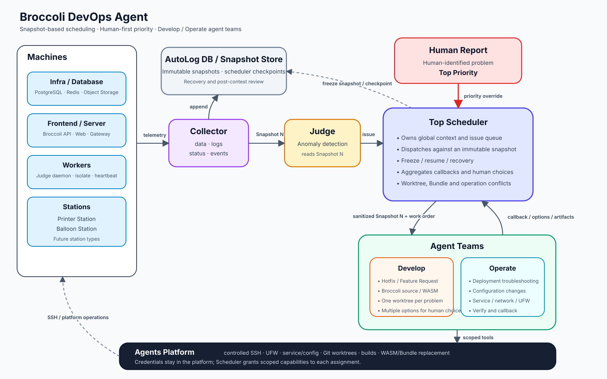

# Broccoli DevOps Agent Architecture

> Status: Draft v0.2  
> Updated: 2026-08-29  
> Scope: Product and system architecture. This document does not yet prescribe a concrete OpenAI model, deployment host, or production permission policy.

## 1. Goal

Broccoli DevOps Agent is an operator-facing control plane for deploying,
observing, troubleshooting, and repairing a Broccoli online judging system.

The system must be useful during a real contest before it is useful as a course
demonstration. The course constraint is that the harness and orchestration layer
are implemented in Rust.

The Agent is not part of Broccoli's contestant request or judging data path.
Broccoli must continue serving contestants and processing submissions if the
Agent, the operator UI, or the OpenAI API becomes unavailable.

## 2. Agreed Design Principles

1. **Snapshot-based reasoning.** Every dispatched Agent job is based on one
   immutable Snapshot. A running job does not silently observe later system
   state.
2. **Global coordination, scoped execution.** The Top Scheduler owns global
   priority, issue, job, conflict, and callback context. Agent Teams receive a
   bounded work order and a sanitized view of a specific Snapshot.
3. **One execution gateway.** SSH credentials and machine mutation live in the
   Agents Platform. Neither the Scheduler nor model prompts directly hold
   credentials.
4. **Human reports have the highest priority.** Human-reported problems bypass
   anomaly detection and enter the Scheduler directly. `HumanTop` priority is
   the default for a human report and is reserved for humans: a reporter may
   deliberately file at a lower priority, but no model or Judge output can ever
   reach `HumanTop`.
5. **Immutable evidence and replayability.** Snapshots, events, model inputs,
   callbacks, actions, and artifacts are recorded so that an incident can be
   replayed and reviewed after a contest.
6. **Separate operation from development.** Operate Teams troubleshoot and
   change deployed systems. Develop Teams modify Broccoli source, plugins,
   WASM, and release bundles in issue-scoped worktrees.
7. **The model proposes; the runtime records and enforces.** Model output is not
   authoritative machine state. The Rust runtime owns IDs, state transitions,
   permissions, action execution, and verification.
8. **Untrusted operational input remains data.** Logs, filenames, compiler
   output, contestant input, and plugin-provided text cannot become executable
   instructions merely because they appear in model context.

## 3. Architecture Overview



The architecture has three main paths.

### 3.1 Observation path

```text
Machines
   │ data / logs / status / events
   ▼
Collector  <── capture / probe requests ── Top Scheduler
   ├──> AutoLog DB / Snapshot Store
   ├──> Snapshot Judge (sanitized Judge View)
   └──> Reporter Agent
```

The Collector runs its own periodic capture schedule. In addition, the Top
Scheduler — and only the Top Scheduler — can request captures on demand: after
a human report, when a Team requests additional Probes, and immediately before
and after an ActionRun. This control edge is the only arrow pointing back into
the observation path; nothing else drives the Collector.

The Collector gathers information from:

- Infra services: PostgreSQL, Redis, and object storage.
- Frontend, API server, and optional gateway.
- Judge workers and their isolate sandboxes.
- Printer Stations and Balloon Stations.
- Representative contestant-network vantage points when configured.

The Collector is responsible for collection, normalization, timestamps,
freshness, redaction metadata, and evidence storage. It does not decide how to
repair a problem.

### 3.2 Control path

```text
Snapshot Judge ──> issue candidate ──┐
                                     ▼
Human Report ────> TOP PRIORITY ──> Top Scheduler
                                     │
                                     │ Snapshot View + Work Order
                                     ▼
                                  Agent Team
                                     │
                                     │ callback / options / artifacts / blockers
                                     ▼
                                 Top Scheduler
```

The component labelled `Judger Agent` in the diagram is an anomaly-analysis
component, not a Broccoli judge worker. This document calls it the **Snapshot
Judge** to avoid that name collision.

The Snapshot Judge examines one immutable Snapshot — through a sanitized Judge
View, see §4.3 — and emits zero or more issue candidates. A candidate is not
automatically a formal Issue. The Top Scheduler deduplicates it, compares it
with active Issues, assigns priority, and decides whether work should be
dispatched.

Human reports bypass the Snapshot Judge. The Scheduler attaches a recent or
newly requested Snapshot (via its capture-request edge to the Collector) before
dispatching work for the report.

### 3.3 Execution path

```text
Top Scheduler
      │ dispatch
      ▼
Agent Team
      │ scoped platform request
      ▼
Agents Platform
      │ controlled SSH / config / service / UFW / Git / build / replacement
      ▼
Machines and repositories
```

The Agents Platform has the network reach and credentials needed to access all
configured machines. Individual Jobs receive narrower capability and target
scopes. All side effects are represented by an ActionRun and are written to the
event log.

Read-only scoped requests (inspection within the Job's capability and target
scope) may flow from a Team to the Platform directly. Mutations may not: a
Team returns an ActionProposal, and only the Scheduler converts it into an
ActionRun and hands it to the Platform, checking the freeze mode at both steps.

## 4. Components

### 4.1 Collector

Responsibilities:

- Collect API health, metrics, logs, service state, machine state, and events.
- Assign observation timestamps and freshness.
- Preserve source and trust metadata.
- Store large or raw data as artifacts rather than embedding it in every
  Snapshot.
- Build immutable Snapshots on periodic or event-driven triggers.

For v0.1, the Collector and Snapshot Builder may be one Rust subsystem. They do
not need to be separate processes.

### 4.2 AutoLog DB / Snapshot Store

Responsibilities:

- Append-only event history.
- Immutable canonical Snapshots.
- Scheduler and Job checkpoints.
- References and hashes for large artifacts.
- Recovery after controller restart.
- Post-contest review and incident replay.

The first implementation may use SQLite for indexed control state and event
metadata, with large logs, diagnostic bundles, patches, WASM, and release
bundles stored as files referenced by content hash.

### 4.3 Snapshot Judge

The Snapshot Judge is hybrid (decided; formerly OD-3): deterministic alert
rules always run, and an LLM additionally correlates evidence across components
and proposes issue candidates the rules cannot express.

Responsibilities:

- Examine one Snapshot at a time.
- Run deterministic alert rules unconditionally; rule output does not depend on
  model availability.
- Use model reasoning for cross-component correlation on top of the rules.
- Emit issue candidates with evidence references and a deduplication key.
- Never dispatch teams or mutate machines directly.

Because model reasoning is involved, the Judge does not read the canonical
Snapshot. It consumes a **Judge View**: a sanitized rendering built by the
Snapshot View Builder with the Judge's own redaction profile, stored as an
Artifact exactly like a Job's Snapshot View. This keeps raw untrusted text
(log excerpts, contestant-derived strings, alert bodies) out of model context
and makes every Judge inspection replayable byte-for-byte.

### 4.4 Top Scheduler

The Top Scheduler is the only component with global orchestration ownership.
It is AI-integrated: a **deterministic harness** wrapped around a **Scheduler
Policy model**. The harness owns every invariant; the model handles judgment
calls, edge cases, and unforeseen situations — but only as proposals.

#### Control flow

Every Scheduler cycle follows one explicit loop:

```text
input (snapshot | issue candidate | human report | team callback | human choice | timer)
   │
   ▼
deterministic pre-checks        mode gates, state machines, dedup keys, scope
   │
   ▼
policy consultation             ONLY at fixed decision points, typed request/response
   │
   ▼
harness validation              clamp priorities, verify references and transitions,
   │                            check conflicts; invalid proposals are errors
   ▼
apply + append events           model input and output stored for exact replay
```

The fixed decision points where the policy model is consulted:

1. **Candidate triage.** Accept, merge into an existing Issue, or reject an
   issue candidate, with a proposed priority. The harness clamps every
   model-proposed priority below `HumanTop` and verifies merge targets exist
   and are open.
2. **Work Order drafting.** Draft the objective, expected outputs, and
   constraints for a new Job. The model cannot widen capability or target scope
   through Work Order text.
3. **Callback interpretation.** After a Job's final result: request a
   resnapshot with specific Probes, convert selected Team proposals into
   ActionRuns, ask a human a concrete question, resolve, or give up. The
   harness validates the proposal against the actual `JobResult` (probe lists
   non-empty, proposal indexes in range) and refuses invalid decisions rather
   than executing them.

Hard invariants never route through the model: freeze modes, approval gates,
state-machine transitions, capability and target scoping, `HumanTop`
reservation, and idempotency. Every consultation is written to the EventLog
with its exact input and output (mixed trust) so post-contest review can audit
each model-influenced decision.

**Fallback:** when the policy model is unavailable, decision points degrade to
conservative deterministic defaults — candidates are recorded and deferred to a
human, Work Orders are derived mechanically from the Issue, and next steps
become a question for a human. Model downtime therefore never breaks
collection, persistence, dispatch bookkeeping, or recovery.

#### Responsibilities

- Maintain formal Issues and their priorities.
- Give Human Reports the highest effective priority by default.
- Request on-demand Snapshot captures from the Collector (the only component
  besides the Collector's own schedule that can).
- Select a base Snapshot for every Job.
- Generate a sanitized Snapshot View and Work Order.
- Dispatch Develop or Operate Jobs.
- Aggregate callbacks, options, artifacts, and blockers.
- Manage human choices.
- Act as the sole gateway that creates ActionRuns and hands them to the Agents
  Platform (this is where freeze modes are enforced).
- Detect Worktree, source, configuration, Bundle, target-machine, and operation
  conflicts.
- Freeze, resume, checkpoint, and recover orchestration.
- Supersede stale Jobs with Jobs based on newer Snapshots.

`Freeze` refers to workflow control, not Snapshot immutability and not an
implicit shutdown of Broccoli. A frozen Scheduler can stop new dispatches while
Broccoli and the Collector continue running.

### 4.5 Agent Teams

#### Develop Team

- Hotfixes and feature requests.
- Broccoli source changes.
- Plugin and WASM changes.
- Release Bundle construction.
- Tests and alternative solution proposals.
- One primary development worktree per Issue.

Develop output is not installed merely because an Agent produced it. Options
return to the Scheduler, human choice is recorded when required, and selected
changes pass conflict checking before an artifact replacement ActionRun.

#### Operate Team

- Deployment troubleshooting.
- Configuration changes.
- Service inspection and control.
- Network and UFW operations.
- Storage, database, Redis, worker, and station troubleshooting.
- Post-action verification and callback.

The exact automatic-write boundary differs by operation mode and remains an
open decision.

#### Team contract

A Team reports through a callback sink, not a single return value: zero or
more interim callbacks (progress, probe requests, human questions) followed by
exactly one callback carrying the final result. The callback's kind is derived
from its content, so a Team cannot label a failure as success. Each running Job
carries a cooperative cancellation signal; supersession, freezing, or human
cancellation signals the Team, which stops at a safe point and still delivers a
final callback describing what was abandoned.

#### Internal parallelism

An Agent Team may later use skills or subagents to investigate independent
subtasks. Those internal agents share the Job's Snapshot View and report to the
Team, not separately to the Top Scheduler. This is an optional implementation
detail, not a required v0.1 component.

### 4.6 Agents Platform

Responsibilities:

- Own SSH and other machine credentials.
- Validate Job capability and target scopes.
- Execute controlled service, configuration, UFW, Git, build, and artifact
  operations.
- Apply idempotency keys, timeouts, cancellation, and output limits.
- Emit ActionRun events and artifacts.
- Support before/after Snapshot verification.

The Platform may internally use system OpenSSH or another transport, but that
choice is not exposed to Agent prompts.

### 4.7 Reporter Agent

The Reporter (decided; formerly OD-6) is a first-class component fed by the
Collector and Snapshot Store, matching the architecture diagram. It summarizes
machine and service status for the human maintainer.

Responsibilities:

- Consume Snapshots from the observation path; never dispatch work or mutate
  machines.
- Render status reports deterministically first; model summarization is an
  optional layer on top of the deterministic rendering.
- Store each report as a `StatusReport` Artifact.

The Reporter is not part of the v0.1 vertical slice, but its boundary
(`ReporterPort`) is reserved now so the observation path does not need
restructuring later.

### 4.8 Registries

Two allowlists back the capability model. They are enforcement points, not
suggestions, and models cannot extend them:

- **Probe Registry** (owned by the Collector): the set of valid `probe_id`
  values. A Team or the Scheduler can only request observations that the
  registry defines; each entry fixes what is collected, from where, and with
  what redaction metadata.
- **Runbook Registry** (owned by the Agents Platform): the set of valid
  `runbook_id` values and their typed argument schemas. An ActionRun can only
  name a registered Runbook, and the Platform validates arguments, capability,
  and target scope against the registry entry before executing anything. This
  is what makes "a model cannot send a free-form shell command" concrete.

`allowed_capabilities` on a Job is interpreted against these registries: a
capability names a subset of Probes and Runbooks the Job may request.

## 5. Core Domain Model

The first version intentionally has only six durable concepts:

```text
Snapshot   The immutable system state used for reasoning.
Issue      A formal problem owned by the Scheduler.
Job        One Team's work based on one Snapshot View.
ActionRun  A recoverable side effect executed through the Platform.
Artifact   A large or independently addressable output.
EventLog   The append-only history of everything else.
```

### 5.1 Snapshot

```rust
struct Snapshot {
    snapshot_id: SnapshotId,
    parent_snapshot_id: Option<SnapshotId>,
    deployment_id: DeploymentId,
    topology_revision: String,
    created_at: DateTime<Utc>,
    cause: SnapshotCause,
    operation_mode: OperationMode,
    resources: Vec<ResourceState>,
    dependencies: Vec<DependencyEdge>,
    active_alerts: Vec<Alert>,
    recent_changes: Vec<SystemChange>,
    coverage_gaps: Vec<CoverageGap>,
    revisions: Vec<RevisionRef>,
    evidence_ids: Vec<EventId>,
}
```

Invariants:

- A Snapshot is immutable after creation.
- Unknown or stale data is explicit and is not treated as healthy.
- Raw secrets are not embedded in a Snapshot.
- Raw or large evidence is referenced by Event or Artifact ID.
- Code, image, plugin, WASM, and Bundle revisions are captured when relevant.

### 5.2 Snapshot View

A Snapshot View is the exact sanitized input made visible to one Job. It is not
a seventh core entity; its serialized form is stored as an Artifact.

```rust
struct SnapshotViewRef {
    snapshot_id: SnapshotId,
    artifact_id: ArtifactId,
    redaction_profile: String,
    content_sha256: String,
}
```

Every Job binds both the canonical `snapshot_id` and the exact Snapshot View
artifact. This permits exact replay of what the model saw.

### 5.3 Issue

```rust
struct Issue {
    issue_id: IssueId,
    source: IssueSource,              // judge | human
    source_event_id: EventId,
    title: String,
    description: String,
    priority: IssuePriority,
    status: IssueStatus,
    opened_snapshot_id: SnapshotId,
    current_snapshot_id: SnapshotId,
    affected_resource_ids: Vec<ResourceId>,
    evidence_ids: Vec<EventId>,
    development_workspace: Option<DevelopmentWorkspaceRef>,
    created_at: DateTime<Utc>,
    updated_at: DateTime<Utc>,
}
```

One Issue may produce multiple Jobs. This is why Issue and Job remain separate.

### 5.4 Job

```rust
struct Job {
    job_id: JobId,
    issue_id: IssueId,
    base_snapshot_id: SnapshotId,
    snapshot_view: SnapshotViewRef,
    supersedes_job_id: Option<JobId>,
    team_kind: TeamKind,              // develop | operate
    status: JobStatus,
    work_order: WorkOrder,
    allowed_capabilities: Vec<String>,
    allowed_target_ids: Vec<ResourceId>,
    result: Option<JobResult>,
    created_at: DateTime<Utc>,
    started_at: Option<DateTime<Utc>>,
    completed_at: Option<DateTime<Utc>>,
}
```

Invariants:

- `base_snapshot_id` and Snapshot View do not change during a Job.
- New evidence that changes the reasoning base creates a new Snapshot and a
  superseding Job.
- Progress, requests, options, and blockers are append-only events.
- Final scheduler-relevant output is stored in `JobResult`.

### 5.5 ActionRun

```rust
struct ActionRun {
    action_run_id: ActionRunId,
    issue_id: IssueId,
    originating_job_id: JobId,
    requested_by_team: TeamKind,
    executed_by: String,              // agents-platform
    runbook_id: String,
    target_ids: Vec<ResourceId>,
    arguments: Vec<NamedValue>,
    status: ActionStatus,
    approval: ApprovalState,
    before_snapshot_id: SnapshotId,
    after_snapshot_id: Option<SnapshotId>,
    idempotency_key: String,
    platform_operation_id: Option<String>,
    execution_artifact_id: Option<ArtifactId>,
    verification_probe_ids: Vec<String>,
    verification_summary: Option<String>,
    created_at: DateTime<Utc>,
    started_at: Option<DateTime<Utc>>,
    completed_at: Option<DateTime<Utc>>,
}
```

An ActionRun exists even when approval is not required. This gives every side
effect a recoverable state and an auditable before/after boundary.

### 5.6 Artifact

Artifact kinds include:

- Snapshot View.
- Raw log or diagnostic bundle.
- Status report.
- Git patch and test report.
- Configuration patch.
- WASM module.
- Release Bundle.
- Platform operation output.

Every Artifact has a content hash, size, creation time, producer reference, and
local or object-storage reference.

### 5.7 EventLog

Events cover all intermediate facts and transitions without requiring a table
for every callback or decision.

Important event families include:

```text
collector.*
snapshot.*
snapshot_judge.*
human.*
scheduler.*
team.*
platform.*
action.*
verification.*
reporter.*        # reserved if a separate Reporter is adopted
```

The event sequence is append-only. Mutable Issue, Job, and ActionRun rows are
materialized control state that can be reconstructed or audited against the
event history.

## 6. Snapshot and Job Semantics

### 6.1 Normal dispatch

```text
Snapshot N
   -> issue candidate or Human Report
   -> formal Issue
   -> sanitized Snapshot View N
   -> Job N
   -> Agent Team
```

### 6.2 Additional evidence

If a Team needs information not present in its Snapshot View, it returns a
probe request instead of reading live state directly.

```text
Job N requests probe
   -> Collector runs probe
   -> Snapshot N+1
   -> Scheduler evaluates whether old work is still applicable
   -> Job N+1 supersedes Job N when necessary
```

### 6.3 Side effect and verification

```text
Before-action Snapshot
   -> ActionRun through Agents Platform
   -> After-action Snapshot
   -> expected-effect verification
   -> callback to Scheduler
```

The absence of an expected effect is a verification failure even when the
underlying command returned exit code zero.

## 7. Scheduling and Conflict Rules

### 7.1 Priority

The initial priority ordering is:

```text
Human Report (default)
  > critical detected issue
  > high detected issue
  > normal issue
  > background or maintenance work
```

`HumanTop` is the *default* for a human report, not a forced value: a reporter
may deliberately file at a lower priority (a printer running low on ink should
not preempt a critical database outage). The reservation runs the other way —
only the human-report path can produce `HumanTop`; every model- or
Judge-proposed priority is clamped to `Critical` or below.

The Scheduler computes effective priority. Models and Agent Teams cannot raise
their own priority.

### 7.2 Workspaces

- One primary development worktree per Issue.
- Independent Issues can be developed concurrently in independent worktrees.
- Multiple options for one Issue are proposals by default; the Platform may
  fork option-specific worktrees only when actual implementations must coexist.
- The base Git revision is recorded before any work begins.

### 7.3 Conflicts

The Scheduler checks at least:

- Overlapping source paths.
- Overlapping configuration keys.
- The same plugin or WASM target.
- The same release Bundle target.
- Incompatible dependency or base revisions.
- Conflicting machine operations.
- Deployment ordering constraints.

Conflict detection can block artifact promotion or machine operations and
request human choice.

### 7.4 Freeze and recovery

The Scheduler supports at least:

```text
running
dispatch_frozen       no new Jobs; active Jobs may checkpoint and finish actions
fully_frozen          no new work or side effects
recovering            reconstructing control state after restart
```

Broccoli and the Collector continue operating while dispatch is frozen.

**Enforcement point:** the Scheduler is the sole gateway that creates
ActionRuns and moves them to execution, and it checks the freeze mode
immediately before both steps — `fully_frozen` and `recovering` refuse them.
The Agents Platform additionally validates every request it receives, so a
bypassed Scheduler check would still fail at the Platform. Every mode change,
including the transitions inside recovery, is written to the EventLog, so the
event stream alone reconstructs the mode history.

## 8. Security and Reliability Boundaries

- The OpenAI API key exists only on the Agent control plane.
- Machine, database, Redis, object-storage, and station secrets never enter
  model context.
- The Agents Platform validates every target and capability request.
- Every model consumer — Agent Teams, the Snapshot Judge, and the Scheduler
  Policy — reads sanitized, artifact-stored views, never raw canonical state.
- Raw logs and contestant-derived strings are untrusted evidence.
- A model cannot send a free-form shell command directly to a machine in normal
  mode.
- Side effects use idempotency keys and bounded timeouts.
- Destructive or contest-sensitive actions can be denied or require approval by
  policy.
- The local collection, Snapshot, EventLog, and recovery path must continue
  when the OpenAI API is unavailable.
- The control plane is not a dependency of the Broccoli judging path.

## 9. Initial Persistence Shape

The first persistence implementation needs only six main tables or collections:

```text
events
snapshots
issues
jobs
action_runs
artifacts
```

Recommended indexes include:

- Events by resource and time.
- Events by Issue, Job, and ActionRun.
- Open Issues by priority and update time.
- Jobs by status and Issue.
- ActionRuns by status and target.
- Snapshots by deployment and creation time.

Large artifact bodies should not be stored inline in SQLite.

## 10. Suggested v0.1 Implementation Scope

The first usable vertical slice should be intentionally narrow:

1. Load a static deployment topology.
2. Collect Broccoli health, system overview, worker, queue, service, and station
   state.
3. Write append-only events and immutable Snapshots.
4. Display or export a Snapshot and its coverage gaps.
5. Accept a Human Report and create a highest-priority Issue.
6. Dispatch one read-only Operate Job based on an exact Snapshot View.
7. Receive a structured callback and persist the Job result.
8. Restart the controller and recover the Issue and Job state.

This slice proves the Snapshot, Scheduler, Team, model, and recovery boundaries
without permitting production mutation yet.

The next slices are:

- Hybrid Snapshot Judge and automatic Issue candidates.
- Read-only troubleshooting with additional-probe/superseding-Job flow.
- Approved Operate ActionRuns with before/after verification.
- Develop worktrees, tests, options, artifacts, and conflict detection.
- Bundle/WASM promotion and rollback.
- Optional Team-internal parallel agents.

## 11. Open Decisions

These questions do not block writing the architecture document, but OD-1 and
OD-2 should be decided before implementing the corresponding runtime paths.
OD-3 and OD-6 have been decided and are kept here with their outcomes so the
numbering stays stable.

### OD-1: Control-plane host and OpenAI connectivity

- Which machine runs the controller during a contest?
- Which machine can reach both the contest LAN and `api.openai.com`?
- What behavior is required when external connectivity is unavailable?

### OD-2: Action authority by operation mode

Define separate matrices for deployment/rehearsal and live contest operation:

- Which configuration changes may Operate Teams apply directly?
- Which service, network, UFW, retry, or replacement actions require approval?
- Which actions are always denied during a live contest?

### OD-3: Snapshot Judge implementation — DECIDED

Resolved as hybrid: deterministic alert rules always run, plus an LLM that
correlates Snapshot evidence and proposes issue candidates. The LLM consumes a
sanitized Judge View, never the canonical Snapshot. See §4.3.

### OD-4: Snapshot cadence and retention

- Periodic frequency.
- Event-triggered Snapshot rules.
- Raw log retention and artifact size limits.
- How long post-contest replay data is retained.

### OD-5: Agent Team and Scheduler Policy backend

- Direct Responses API orchestration in the Rust harness.
- Codex/subagent-backed development work.
- A backend abstraction supporting both.

Whatever is chosen also serves the Scheduler Policy model (§4.4) and the
Snapshot Judge's LLM layer (§4.3): all three sit behind ports, so the backend
decision is shared and swappable.

### OD-6: Reporter — DECIDED

Resolved as a distinct Reporter Agent consuming Snapshots from the observation
path, with deterministic rendering first and optional model summarization. See
§4.7. A Reporter implementation is still not required for the first vertical
slice.

### OD-7: Conflict policy and artifact promotion

- What constitutes a source, config, Bundle, and operation conflict?
- Who selects between multiple Develop options?
- What evidence is required before WASM or Bundle replacement?
- What rollback artifact must be retained?

### OD-8: Evaluation scenarios

Build a replayable incident corpus covering at least:

- PostgreSQL unavailable or connection saturation.
- Redis unavailable, full, or returning OOM.
- Worker heartbeat loss, version drift, isolate, or cgroup failure.
- Queue growth caused by insufficient capacity or a downstream dependency.
- Object-storage latency or missing bucket.
- Frontend healthy from the server but unreachable from contestant network.
- Printer Station offline or repeated print failures.
- Conflicting Develop worktrees or Bundle targets.
- OpenAI API unavailable during an incident.

## 12. Acceptance Criteria for the Architecture

The design is ready to move from architecture into implementation when:

- Every Agent Job has an immutable base Snapshot and replayable Snapshot View.
- Human reports bypass anomaly detection and have deterministic top priority.
- The Scheduler, Team, and Platform responsibilities are unambiguous.
- A controller restart cannot lose an active Issue, Job, or ActionRun.
- Every side effect has an auditable requester, executor, before state, and
  verification result.
- Develop and Operate workflows can coexist without bypassing conflict checks.
- OpenAI unavailability does not break collection, persistence, recovery, or
  Broccoli itself.

