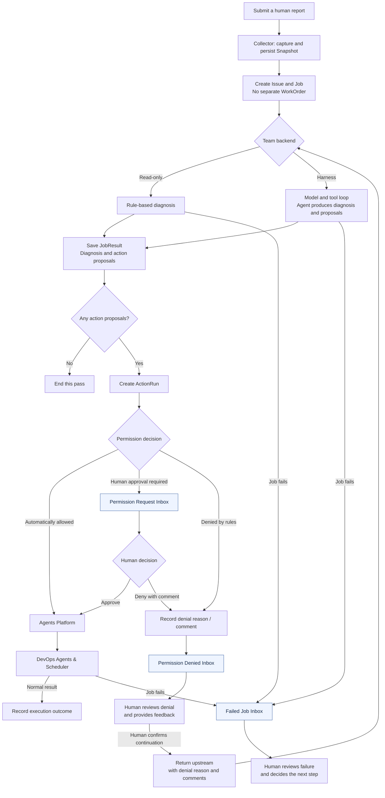

Please use the following design feedback for the next iteration of the Broccoli DevOps Agent.

1. **Simplify the task model: remove `WorkOrder`.**

   I do not think `WorkOrder` adds useful meaning as a separate abstraction. An `Issue` and a `Job` should be sufficient to express the task workflow. Keep capturing and persisting Snapshots as the evidence used for diagnosis, but remove the separate WorkOrder layer.

2. **Keep the diagnosis and action-proposal flow explicit.**

   A human report triggers the Collector to capture and persist a Snapshot. The system then creates the Issue and Job and runs the selected Team backend:

   - **Read-only backend:** rule-based diagnosis.
   - **Harness backend:** a model-and-tool loop in which the agent produces a diagnosis and action proposals.

   Save the diagnosis and any action proposals in `JobResult`. If there are no action proposals, this processing path ends. If there are proposals, create ActionRuns and evaluate their permissions.

3. **Use a unified Inbox with distinct categories.**

   The Inbox should contain several separate categories, rather than only an approval queue:

   | Category | What belongs in it | Human interaction |
   | --- | --- | --- |
   | **Permission Request Inbox** | Operations that require human approval before execution. | Review the request, then approve or deny it. |
   | **Permission Denied Inbox** | Operations denied either by permission rules or by a human. | Review the denial reason and comments, provide feedback, and confirm whether to send the task back upstream. |
   | **Failed Job Inbox** | Jobs that have failed. | Review the failure and decide how it should be handled. |

   The “Failed” label in my sketch refers to the **Failed Job Inbox category**. It does not mean that permission denials and job failures should all be assigned the same `Failed` state.

4. **Preserve denial comments and support human-confirmed feedback.**

   Permission decisions have three paths:

   - **Automatically allowed:** proceed to execution.
   - **Human approval required:** enter the Permission Request Inbox. Approval proceeds to execution; denial enters the Permission Denied Inbox.
   - **Denied by permission rules:** enter the Permission Denied Inbox.

   A denial should include an explanatory reason or comment. Human and automatic denials should both be visible in the Permission Denied Inbox.

   After human confirmation, send the denial reason and any additional comments back upstream so that the agent can reconsider the task and produce a revised diagnosis or action proposal. The feedback must participate in the next processing pass, rather than merely being displayed in history.

5. **Keep the execution layer visible in the workflow.**

   Automatically allowed or human-approved actions enter the **Agents Platform**. My sketch places a **DevOps Agents & Scheduler** execution block underneath that platform. Keep this execution block explicit when discussing how approved actions are carried out.

   Actual job failures should be routed to the Failed Job Inbox, separately from permission requests and permission denials.

The following flowchart shows the proposed routing. “End this pass” describes the end of a processing path; it does not specify an Issue-resolution rule.

