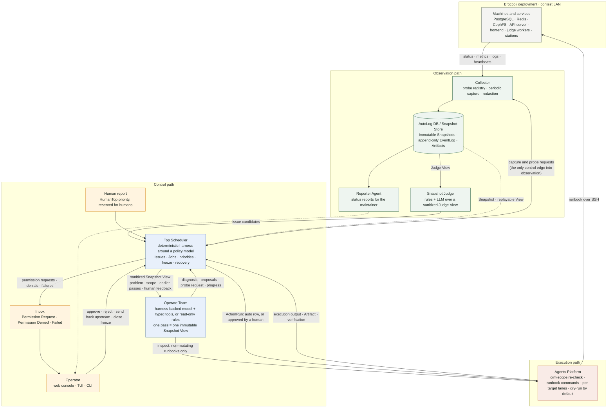
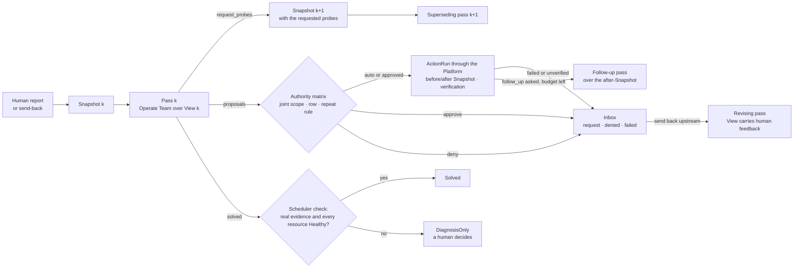

# Broccoli DevOps Agent — Project Overview

> Presentation document · working tree as of 2026-09-06 · control plane v0.1, architecture draft v0.6
> Companion files: [`architecture.mmd`](./architecture.mmd) (the graph below), [`broccoli-devops-agent.pptx`](./broccoli-devops-agent.pptx) (the slides), and the repository [README](../../README.md) with its Quickstart.

## 1. Executive summary

Broccoli DevOps Agent is an operator-facing control plane for deploying, observing, troubleshooting, and repairing a [Broccoli](../../README.md) online-judge deployment during a programming contest. It is written in Rust, with its own model-agnostic agent harness, and it puts a language model to work under one rule that shapes every part of the design:

> **The model proposes; the runtime records and enforces.**

The runtime observes the deployment through read-only probes and freezes what it saw into immutable Snapshots. A human report, or later an anomaly detector, opens an Issue. The Top Scheduler hands an Operate Team a sanitized, replayable Snapshot View and the Team, a model with typed tools, investigates in a bounded chain of passes: it can read the View, inspect a target read-only, ask for more probes, propose runbook actions, and submit a diagnosis. Every proposal is decided by an approved authority matrix, executed only through operator-configured runbook commands, verified against an after-Snapshot, and parked in a three-category inbox whenever a human must decide. Everything is written to an append-only event log, so an incident can be replayed after the contest and the controller can recover its control state after a restart.

The result is an agent that is useful in a real contest before it is useful as a course demonstration: it never holds credentials, never runs a free-form shell command, never resolves an Issue on its own word, and never touches a machine until the operator leaves dry-run mode.

## 2. The problem

A Broccoli deployment on contest day is several hosts and services, PostgreSQL, Redis, CephFS or object storage, the API server, the frontend, judge workers with their sandboxes, printer and balloon stations, all of which must keep working while hundreds of contestants submit. Three things make operating it hard:

- **Failures are spread across hosts and often invisible.** A judge worker has no inbound port; its only honest signal is a heartbeat in Redis. A slow storage volume keeps every port open while latency climbs a hundredfold. "Reachable" is not "healthy".
- **The people who can fix it are few and busy.** During a contest, every minute of judging downtime is a fairness problem, and the operator answering the report is also the person who could break more by acting in haste.
- **Any automated remediation is risky.** Restarting the wrong service, purging a queue, or changing a scoring key can alter verdicts. An assistant that acts must be constrained by policy, not by prompt wording.

The course constraint is that the harness and orchestration layer are implemented in Rust. The project constraint the operator set on top is that the design must follow their architecture diagram, that human reports outrank everything, and that no model output is ever authoritative machine state.

## 3. Design principles

Eight principles were agreed before implementation and every later decision was checked against them:

| # | Principle | What it means in practice |
|---|---|---|
| 1 | Snapshot-based reasoning | A Job reasons over one immutable Snapshot; it never silently reads later state. |
| 2 | Global coordination, scoped execution | The Scheduler owns priorities, Issues, Jobs, conflicts; Teams get one sanitized View and one scope. |
| 3 | One execution gateway | Credentials and machine mutation live in the Agents Platform only. |
| 4 | Human reports have the highest priority | `HumanTop` is reserved for humans; model and Judge output is clamped below it. |
| 5 | Immutable evidence, replayable runs | Snapshots, Views, transcripts, callbacks, actions, and events are stored for replay. |
| 6 | Operation separate from development | Operate Teams change deployed systems; Develop Teams change source in worktrees. |
| 7 | The model proposes, the runtime enforces | IDs, transitions, permissions, execution, and verification belong to the Rust runtime. |
| 8 | Untrusted input stays data | Logs, filenames, contestant strings, and report text are fenced as untrusted in model context. |

## 4. Architecture

The architecture has three paths. The observation path turns machines into Snapshots. The control path turns Snapshots and reports into Issues, Jobs, and decisions. The execution path turns approved decisions into runbook commands and verifies their effect.

### 4.1 Observation path

The **Collector** reads a static topology file (every machine, endpoint, and dependency edge) and runs read-only probes against it. Six probes exist today:

| Probe | Reads | Health signal |
|---|---|---|
| `tcp.connect` | reachability and latency of `host:port` | Degraded above a latency threshold |
| `http.status` | status code of a plain HTTP GET | latency as above |
| `redis.llen` | length of one Redis list (queue backlog) | Degraded outside `[min, max]` |
| `http.json` | one value at a JSON pointer | exact `expect` or a numeric range |
| `broccoli.worker` | a worker's heartbeat from Broccoli's admin API | Healthy on a live heartbeat, Degraded when stale, Down when absent |
| `broccoli.queue` | one queue's depth from the admin overview | Degraded outside `[min, max]`, plus in-progress and dead-letter counts |

Two rules matter more than the probe list. A resource with no probe is **Unknown with an explicit coverage gap**, never assumed healthy. And every Snapshot is **immutable**: it records what was observed, when, with what freshness and trust, and it references large evidence by Artifact ID instead of embedding it. While `serve` runs, the Collector captures one Snapshot at startup and one every two minutes in every Scheduler mode, frozen included.

The **Snapshot Judge** (hybrid: deterministic alert rules plus an LLM reading a sanitized Judge View) and the **Reporter Agent** are designed and have reserved ports; automatic incident intake through the Judge is the next slice.

### 4.2 Control path

The **Top Scheduler** is the only component with global orchestration ownership. It is AI-integrated in a specific way: a deterministic harness wraps a Scheduler Policy model that is consulted only at fixed decision points (candidate triage, callback interpretation), through typed requests, and whose every answer is validated and clamped before it is applied. Hard invariants never route through the model: freeze modes, approval gates, state-machine transitions, capability and target scoping, the `HumanTop` reservation, idempotency. When the model is unavailable, every decision point degrades to a conservative deterministic default, and collection, persistence, dispatch bookkeeping, and recovery continue.

There is no separate work-order layer. An **Issue** says what is wrong; a **Job** is one bounded pass by one Team over one Snapshot View. The View carries the problem statement (fenced as untrusted text), the Job's scope, the human feedback the Issue has received, and every earlier pass of the same investigation, so the Team's whole input is one replayable Artifact.

The **Operate Team** has two backends behind one port: a deterministic read-only backend that diagnoses from the View and never proposes, and the harness backend, a model with six typed tools per pass:

| Tool | Effect |
|---|---|
| `read_snapshot_view` | the sanitized View, fenced as untrusted data |
| `inspect` | a non-mutating runbook (`service.status`, `log.tail`, …) on an in-scope target, through the Platform; output returned as untrusted data |
| `request_probes` | ends the pass; a fresh Snapshot with those probes starts the next one |
| `report_progress` | a progress line for the consoles |
| `propose_action` | a runbook, targets, arguments, reason, expected effect, and verification probes |
| `submit_diagnosis` | `diagnosis_only` or `solved`, optionally asking for a follow-up pass |

### 4.3 Execution path

The **Agents Platform** is the one place with machine reach. It executes runbooks as the commands the operator maps in `config/agent.toml`, one command per target, with credentials staying in the machine's SSH agent. It re-validates every request (target kinds, scope, arguments), serializes executions per resource in execution lanes so two actions never touch one machine at once, runs each command in its own process group with a wall-clock limit, kills and reaps the whole group on timeout, and stores complete output as an Artifact. It starts in **dry-run** mode: commands are rendered and recorded, not executed, until the operator sets `dry_run = false`.

## 5. The investigation loop

A single pass over a single Snapshot cannot handle every situation: the evidence the model needs may not be in the Snapshot, and the effect of a remediation must be checked before the next step. The design answer is to chain passes rather than to let a running Job read live state.

Rules the runtime enforces, not the model:

- **Pass budget.** `[agent] max_auto_passes` (default three: observe, act, check) bounds the passes run without a human per report or per send-back. At zero the probe-request tool is not even offered; a Team that still asks stalls in the Failed inbox.
- **One pass, one Snapshot.** A probe request cannot follow a proposal in the same pass, and `solved` cannot be claimed while proposals are pending.
- **Follow-up only after settlement.** A follow-up pass runs only when every proposal has been executed or denied; a held action stops the chain and the human's approval resumes it.
- **"Solved" is a claim.** The Scheduler accepts it only when an ActionRun on the Issue succeeded with Weak or Strong evidence (never dry-run) and every resource the Issue touches is Healthy in the pass's own Snapshot. Otherwise the result is recorded as DiagnosisOnly with a `scheduler.result_clamped` event.

Every continuation is an event: `scheduler.job_superseded`, `scheduler.job_continued`, `scheduler.pass_budget_exhausted`, and each pass is linked to its predecessor (`supersedes_job_id`, `continues_job_id`, `revises_job_id`), so the chain is walkable in both directions.

## 6. Authority, the inbox, and the feedback loop

Every Team proposal becomes an **ActionRun**, even when no approval is required, so every side effect has a recoverable state and an auditable before/after boundary. Before the matrix row applies, the Scheduler validates the whole proposal: the runbook exists, every target's kind is allowed for that operation class (a worker restart cannot be pointed at the API server), every target is in the Job's scope, the class's capability is granted, and the arguments are present and shell-safe. Then the **authority matrix** ([`docs/action-authority.md`](../action-authority.md), 26 operation classes across `rehearsal`, `contest_locked`, and `post_contest`) decides:

| Operation class (examples) | rehearsal | contest_locked | post_contest |
|---|---|---|---|
| Observe: probes, log reads, status queries | auto | auto | auto |
| Restart a judge worker | auto | auto | auto |
| Restart the API server | auto | approve | auto |
| Purge a queue | approve | **deny** | approve |
| Change a contest-affecting config key | approve | **deny** | approve |
| Deploy a release Bundle | approve | **deny** | approve |
| Reboot a machine | approve | approve | approve |
| Free-form shell command | **deny** | **deny** | **deny** |
| Change the operation mode | human-only | human-only | human-only |

On top of the matrix: deny is never approvable, a repeated automatic action on the same target inside a window escalates to approval, a duplicate of a live action is denied by its idempotency key, and every transition is a compare-and-set so two operators cannot both apply.

Whatever the automation could not finish waits in **one inbox with three categories**:

| Category | Contains | Decisions |
|---|---|---|
| Permission Request | actions on an `approve` row | approve, or reject with a comment |
| Permission Denied | rule denials (with the rule's rationale) and human rejections (with the comment) | acknowledge, or send back upstream |
| Failed | failed Jobs, failed executions, failed verifications, stalled passes | acknowledge, or send back upstream |

**Send back upstream** is the human-in-the-loop mechanism: the Scheduler captures a fresh Snapshot, builds a View whose `human_feedback` carries the denial reason, the failure summary, sanitized execution evidence, and the operator's comment, and dispatches a revising Job under the same Issue. The Team must visibly use that feedback, and its new proposals go through the matrix again. Operator feedback is trusted direction for the model; report text and logs stay untrusted.

## 7. Verification, freeze, and recovery

**Verification is per operation class and graded.** Observe-only classes pass on execution success. Mutating classes must show their effect in the after-Snapshot: every target Healthy, observed after the action started, every named verification probe run, a purged queue at depth zero. Evidence is `strong` when the postcondition was observed to change, `weak` when the target was already healthy, and `dry_run` when nothing executed. Only real evidence resolves an Issue; a rehearsal never does.

**Freeze is workflow control.** `dispatch_frozen` stops new Jobs while active ones finish; `fully_frozen` stops all side effects; both are checked by the Scheduler immediately before creating an ActionRun and before handing it to the Platform, and the Platform validates again. Reaching the spend ceiling freezes the Scheduler the same way.

**Recovery runs before serving.** `serve` reads the previous process's last mode from the EventLog and reconciles what a crash left behind: a running Job has no Team any more and fails into the inbox; a `Running` action has an unknown outcome and fails into the inbox with that warning; a `Verifying` action is verified now against a fresh Snapshot; an action never started is denied so it can be proposed again. Dispatch resumes automatically only after a clean restart; otherwise the Scheduler stays frozen until a human, who sees the recovery summary in the console, resumes.

## 8. What the operator sees

The control plane exposes an HTTP + SSE API. Three clients use it and hold no state of their own: a web console (React 19 + Vite + Tailwind v4, styled with Broccoli's own design tokens so it reads as part of the same operator tooling), a terminal console (ratatui), and the CLI. Everything a console does is an API call onto an existing runner operation, so the authority matrix and the event log apply to UI actions exactly as to CLI ones, and every decision records the operator's name.

Three features were built against the course's graded requirements:

| Requirement | What shipped |
|---|---|
| **R4 · real-time progress and interruption** | The harness reports every model turn, tool call, retry, and budget wrap-up through a progress observer; those lines join the model's own `report_progress` in one ordered SSE stream. A running pass is registered by Job ID and can be interrupted from the web console, the TUI, `POST /api/jobs/{id}/cancel`, or Ctrl-C. Cancellation is cooperative: the Team stops at its next step boundary, still delivers a final callback, and the Job lands in the Failed inbox with its transcript kept. |
| **R5 · context history: past tasks, save/load, trace** | The Issues & jobs page is the history, filterable and searchable. Its Trace page shows the pass chain and, per pass, the transcript entry by entry: inputs, each model turn with latency and tokens, every tool call with arguments and output, harness notices, the result, the actions with their matrix and human decisions, and the Issue's events. While a pass runs the transcript grows live from `team.step` events, like a coding agent's terminal; when it ends the stored transcript takes over, identical entry for entry. **Export** writes the whole session (Issue, passes, transcripts, Views, actions, Snapshots, events) as one JSON file with SHA-256 checks on every body; **Import** loads it as a read-only archive that every control decision ignores. |
| **R6 · token and cost tracking with a halting budget** | Every backend response's `usage` block is parsed in both wire formats, recorded per Job and as `model.usage` events, and totalled from the log. Costs are derived on demand from counts and the price list, so a changed price re-prices history. `max_tokens_per_run` bounds a pass through the same wrap-up path as the turn and tool budgets; `[budget]` bounds the deployment and freezes the Scheduler when reached. A relay that reports no usage is counted as unknown, never as free. |

The **Settings** page is a configurator over the live process. Config values fall into three classes: **live** values (capture cadence, passes per chain, per-pass budgets, prices, spend ceiling) apply to the next pass; **policy** values (dry-run, command timeout, repeat window, classification lists, runbook commands) can be changed only while the Scheduler is frozen, under an operator's name, with an explicit confirmation to leave dry-run; **startup** values (paths, relay, bind address, language) are read-only until restart. Accepted changes are written back into the config file with comments kept, so the file stays the single source of truth.

Language is two settings by design: the agent's output language (`en` or `zh-CN`) is fixed for the life of the process so the event log never switches mid-incident, while each console translates its own chrome at runtime, per viewer.

## 9. Domain model

The system has six durable concepts and nothing else:

| Concept | Role |
|---|---|
| Snapshot | the immutable system state used for reasoning, with explicit coverage gaps |
| Issue | a formal problem owned by the Scheduler; status derived from outstanding work, closed explicitly by a human |
| Job | one Team's pass over one Snapshot View, linked to the pass it supersedes, continues, or revises |
| ActionRun | a recoverable side effect executed through the Platform, with approval, denial, review, evidence, and before/after Snapshots |
| Artifact | a large or independently addressable output: Views, transcripts, execution output, session files |
| EventLog | the append-only history of everything else, including every model consultation with its exact input and output |

State lives in a file-backed store: one JSON document per record, written atomically (temp file, fsync, rename), every event line synced, every update a compare-and-set. The store contract is kept so SQLite is a drop-in swap.

## 10. Implementation status

| Metric | Value |
|---|---|
| Rust (control plane, harness, TUI, tests) | about 27,000 lines |
| TypeScript (web console) | about 4,200 lines |
| Automated tests passing (control plane + harness) | 105 |
| Integration test suites | 12 files plus the harness loop suite |
| Authority matrix | 26 operation classes × 3 operation modes |
| Probes / Team tools / inbox categories | 6 / 6 / 3 |
| Commits on `main` | 18, from 2026-08-29 to 2026-09-05 |

Workspace: `broccoli-devops-agent` (root: domain, ports, Scheduler, Collector, stores, Platform, policy, Teams, API, CLI), `crates/harness` (`broccoli-agent-harness`: the model-agnostic loop, typed allowlisted tools, terminal tools, budgets with wrap-up turns, retries with backoff, cancellation, replayable transcripts; it knows nothing about Broccoli), `crates/tui` (the terminal console), and `web/` (the web console). The control plane depends on the harness, never the reverse; the UIs depend only on the API.

Timeline:

| Date | Milestone |
|---|---|
| 2026-08-29 | Schemas and the first architecture draft, checked against the operator's diagram |
| 2026-08-30 | v0.1 vertical slice; the harness crate and the harness-backed Operate Team |
| 2026-09-03 | GPT relay backend and config; the authority matrix encoded and the ActionRun path opened; HTTP/SSE API with web and terminal consoles |
| 2026-09-05 | Design review round 1 (three-category inbox, feedback loop, no WorkOrder) and round 2 (joint scope, compare-and-set, process-group kill, recovery, graded verification); Broccoli admin-API probes; Chinese output and console language; token and cost budget; live progress and interruption; the investigation loop |
| working tree | Context history (live trace, session export/import), the Settings configurator, periodic capture |

## 11. Testbed and evaluation

[`testbed/`](../../testbed) brings up three OrbStack Linux VMs, each with its own Docker engine, so the control plane observes and acts on real services across real hosts: `infra-1` (PostgreSQL, Redis, SeaweedFS), `app-1` (`broccoli-server` and the frontend), and `judge-1` (a judge worker with isolate). The controller stays on the Mac, as it will in the contest. `config/agent.testbed.toml` runs the Platform with `dry_run = false`, so ActionRuns really restart containers through `testbed/runbook.sh`.

Fault scenarios differ in what the Collector can and cannot see, which is the point of the evaluation:

| Scenario | What the probes see | What the agent must work out |
|---|---|---|
| `stop-service.sh redis-mq` | `redis-mq` Down | which dependents are affected and in what order to recover |
| `stop-service.sh broccoli-server` | server and frontend Down | whether the cause is the server or something under it |
| `stop-service.sh worker-1` | nothing without the heartbeat probe | the failure is invisible; a coverage gap must be said, not guessed |
| `partition.sh app-1 infra-1` | server Down, infra Healthy | the link between two hosts, not either host |
| `slow-storage.sh` | everything Healthy, latency 100× | latency, not availability |

## 12. Boundaries and roadmap

Deliberately not implemented in v0.1:

- Model-backed Scheduler decisions: the harness and the harness-backed Team are wired to the relay, but the Scheduler Policy and Snapshot Judge adapters are not, so every decision point runs its deterministic fallback, on purpose, so that path is exercised first.
- Automatic incident intake: Snapshots are captured on a schedule, but reports are still operator-triggered.
- A fourth inbox category for model questions (`NeedsHuman`): the operator's diagram fixes three.
- A model-driven executor inside the Platform: the last gate before a machine changes stays deterministic.
- Develop worktrees, Bundle/WASM promotion and rollback, Team-internal parallel agents, SQLite.

Next slices, in order: the hybrid Snapshot Judge and automatic Issue candidates; a Scheduler Policy model behind `advise_next_step`; human questions from a Team as an inbox interaction; Develop worktrees and conflict detection; Bundle/WASM promotion.

## 13. Suggested demo (about eight minutes)

1. `cargo run --example live_demo -- data-live` and `cd web && pnpm dev`. Open the console: the Overview with the live Snapshot and coverage gaps.
2. File a report. Watch progress lines appear on the form; open the Trace page and watch the transcript grow one entry at a time. Press Interrupt on a second report to show a cooperative cancel landing in the Failed inbox.
3. In the inbox, approve the held queue purge; show the action's matrix decision, evidence grade, and the after-Snapshot. Reject one with a comment and send it back upstream; show the revising pass reading the feedback.
4. Open Spend: tokens, cost against the ceiling. Open Settings: change a live value, then try a policy value while running (refused until frozen).
5. Export the session as JSON; import it into a second data directory; show it traced as a read-only archive.
6. Kill `serve` mid-pass and start it again: the recovery summary, the frozen Scheduler, the interrupted Job in the inbox.

## 14. References

- [Architecture document](../architecture.md) (draft v0.6)
- [Action authority matrix](../action-authority.md)
- [Implemented workflow at d805bf1](../workflow-d805bf1.md)
- [Design feedback rounds](../fable-design-feedback.md), [round 2](../remaining-issues-d805bf1-zh-en.md)
- [Excalidraw source of the operator's diagram](../broccoli-devops-agent-architecture.excalidraw)
