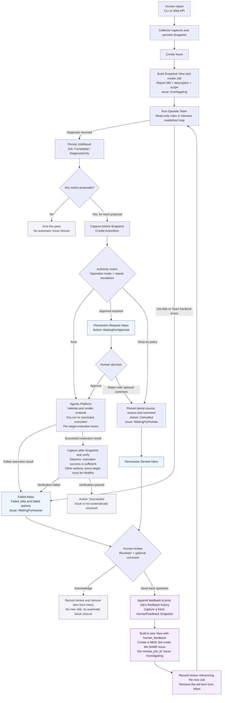

Implemented workflow for Broccoli DevOps Agent at commit `d805bf1`, inspected on 2026-09-05.

This diagram describes the currently wired report, action, inbox, and human-feedback paths. It includes the normal diagnosis result and the modeled Job/action failure outcomes. English labels are used so the diagram can be shared with Fable alongside the original design feedback.

Important details verified in the implementation:

- `WorkOrder` and the work-order policy decision point are gone. `JobBrief` only packages constructor inputs; its fields are stored on the Job. The View now contains the report title and description, scope, and human feedback.
- A Job is still one processing pass. Sending an item upstream creates a new Job under the same Issue, linked by `revises_job_id`; it does not resume the old completed or failed Job.
- The UI has three inbox categories. The Failed category combines `failed_jobs` and `failed_actions`; the latter includes both execution failure and verification failure. Inbox membership is computed from the stored records and whether they have a human review.
- Permission requests can be approved or rejected. Rejection records the human's identity and optional comment, then puts the action in Permission Denied. A rule denial records the policy rationale directly.
- Denied and failed items support `acknowledge` and `send_upstream`. Acknowledgement records a review without changing the old failure/denial into success or resolving its Issue.
- Sending upstream copies the selected prior Job's accumulated feedback and appends the new denial/failure information and reviewer comment. A fresh Snapshot and a revising Job are created, and the review naming that Job is persisted before its Team runs. Revised proposals pass through the same authority matrix.
- The Harness receives feedback in its input and in the stored View. The read-only Team includes the feedback in its diagnostic summary but still proposes no actions.
- The execution-layer scheduler is implemented as per-target locks in `LocalCommandPlatform`, within one Platform instance. Actual execution remains configured shell/runbook commands; there is no additional model-based execution Team in this block.
- Normal `DiagnosisOnly` completion, successful ActionRun verification, and inbox acknowledgement do not automatically resolve the Issue. A pending permission request also does not itself move the Issue to `WaitingForHuman`; denials and recorded Job/action failures do.
- Manual Snapshot capture remains a separate observation-only command. Periodic collection, automatic Snapshot Judge intake, and automatic next-step policy orchestration are not wired into this report/review path.

Code references:

- [Report dispatch and Team-error handling](../src/runner.rs#L269)
- [Action-proposal execution](../src/runner.rs#L323)
- [Human review and revision dispatch](../src/runner.rs#L391)
- [Inbox projection](../src/runner.rs#L548)
- [Snapshot View contents](../src/view.rs#L155)
- [Issue transitions after Team results](../src/scheduler.rs#L504)
- [Action verification](../src/scheduler.rs#L890)
- [Per-target execution lanes](../src/platform.rs#L72)
- [Inbox and feedback integration tests](../tests/inbox.rs)

Validation: `cargo test --workspace --all-targets --offline --quiet` passed all 57 tests, including the five inbox/feedback integration tests. Those integration tests use a scripted model, temporary stores, local probe listeners, and a dry-run Platform. `pnpm build` in `web/` also passed the TypeScript and Vite production build.
